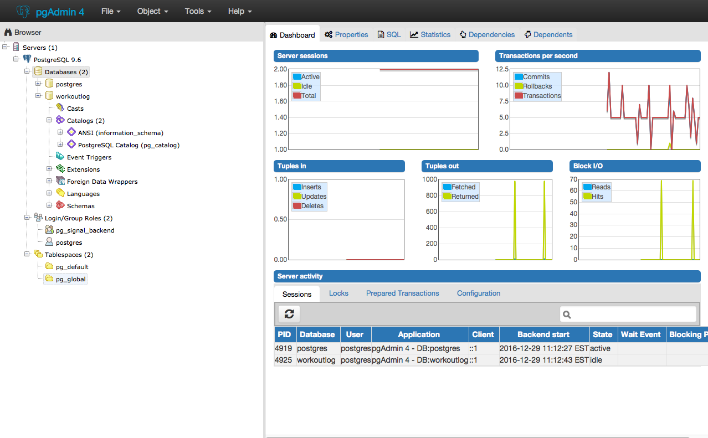

# PG INSTALL
---

In this module we'll set up PG Admin, which will serve as our database for our server.

### Location
In this module you'll be working here:

TODO: Screenshot of database in client-server diagram flow.

### Install Directions

TODO: Number these.....Emphasize: REMEMBER YOUR PASSWORD!!!!

Come up with a Postgres password right now. Make it unique. Don’t make it into a password that you use for anything else. Take the time to record this password somewhere safe. Resetting a PostgreSql can be a pain. . I use Letmein1234! 
Let’s start by installing Postgres https://www.postgresql.org/download/
While that’s installing, take a look around: What is Postgres? A Postgres tour…
When the download is done, go through the install steps. NOTE: You should set the port to 5432 (this is the default DO NOT change it, please!!).
After the download completes choose PostgreSQL from the dropdown in Stack Builder.
Open up pgadminIII(or 4)
Mac users should click on plug
Open the Server & Open Postgres
Login with your memorable password.
Right click on database.
Choose Create Database.
Name it workoutlog.
 

That’s all we need for right now.
If you have problems with this, we’ll help you.
Now go get some rudimentary SQL under your belt so that you can use the Database.....

