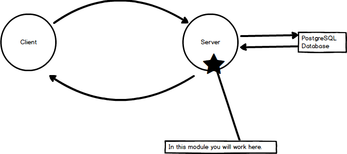

# SERVER PACKAGES
---
In this module we'll set up a few of the server packages(dependencies) that will be used in this application.

<hr />

### Orientation


### What is a dependency?
A dependency is a necessary requirement for a class or interface to use.<br>
Think of this analogy: 
* If you have a TV remote, you also need the batteries.
* You cannot use the remote without also using those batteries. 
* Furthermore, you cannot continuously reuse that remote unless you also continuously reuse those batteries.  
* If your batteries fail, you can no longer use your remote. 

Just like the remote depends on batteries. Your application will have other applications and frameworks(like Express) in the form of packages to rely on for it to run.

### npm init
Let's initialize `npm` as our package manager for our dependencies. To initialize npm in the application, go through the following steps:

1. Open the `server` folder.
2. Open the command line window.
3. Run `npm init`.
4. Hit enter through all the prompts. 
5. You should see a new `package.json` file in your `server` folder.

### package.json
1. Take out the contents of the `package.json` file.
2. Replace the contents with this code:  

```json
{
  "name": "workoutlogserver",
  "version": "1.0.0",
  "description": "server for workout log app",
  "main": "app.js",
  "scripts": {
    "test": "echo \"Error: no test specified\" && exit 1",
    "start": "node ./node_modules/http-server/bin/http-server"
  },
  "author": "YOUR NAME HERE",
  "license": "MIT",
  "dependencies": {
    "bcryptjs": "^2.4.0",
    "body-parser": "^1.15.1",
    "dotenv": "^4.0.0",
    "express": "^4.13.4",
    "jsonwebtoken": "^7.2.1",
    "pg": "^4.5.6",
    "pg-hstore": "^2.3.2",
    "sequelize": "^3.23.3"
  }
}
```

3. Run `npm update`. This will read all of the new dependencies from the `package.json` and load them all in the node_modules folder. 
4. Know that adding these new packages to `package.json` file allows us to freeze the particular versions of each dependency so that they harmonize together without breaking the application. For instance, let’s say that dependency bcrypt has changed to `3.0.0` and the new version does not work well with sequelize `4.0.0`. Such a change might break our app. 

### Project Dependencies
Here is another quick cheatsheet for the dependencies that will be used in this application. We'll be explaining thse through the build:

| Package       | Purpose    | 
| ------------- |:-------------:|
| bcrypt        | Password-specific hashing that protects your password from being stored in plain text |
| body-parser   | Parses the body of an http request before it reaches an endpoint's functionality |
| dotenv        | Allows developers to safely store configuration data |
| express       | A web framework for Node.js that allows routing and processing HTTP requests |
| jsonwebtoken  | a compact and self-contained way for securely transmitting information between parties |
| pg            | a dependency for working with Postgres. |
| pg-hstore     | a dependency for working with Postgres for advanced functions with Postgres. |
| sequelize     | A tool that allows us to map models, pass data, complete queries with a database. |

We'll talk about what these dependencies do as we go through this application. 
