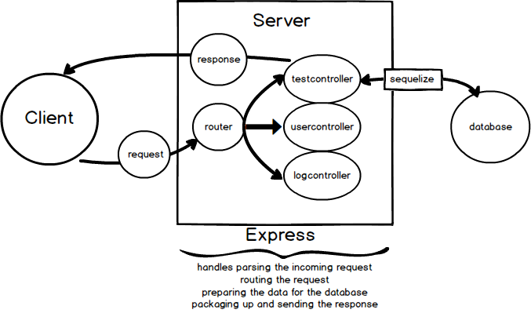

# EXPRESS INTRO
---

In this module, we'll introduce you to the most important dependency in our server, which is Express.

### Express Overview
Express is a Node.js framework that provides developers with tools for building web and mobile applications. Express is well known for making it extremely quick and easy to build APIs. That's what we'll be doing: building an API.  

Let's show you a useful overview of some big picture things that Express will help you to handle. We'll refer to this diagram as you move through these lessons:

