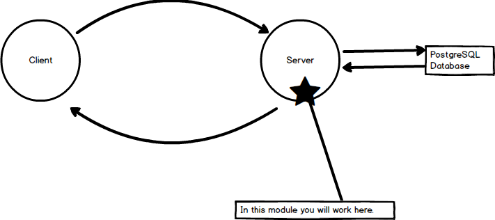

#SERVER SET UP
---
In this module we'll simply get a starter up going with Express. 

<hr>

### Screenshot



### File Structure
TODO

### app.js 
TODO: Explain the code
```js
var express = require('express'); //1
var app = express(); //2

//3
app.listen(3000, function(){
	console.log('App is listening on 3000.')
});
```

### Analysis
TODO: Explanations
1. quick explain of express package.
2. TODO: Link to the express() docs.
3. Explain app.listen

### Testing
When we go to http://localhost:3000/, we will see the application running:


TODO: Add something to use with Postman here?


### Video Support
TODO: Check to see if this throws them off....It might have stuff that they don't have.....We no longer have a client.....

https://youtu.be/OcNSIg1W6m0


### Completed Code
Here is the [completed code](https://github.com/ElevenfiftyAcademy/JavaScript-201-WorkoutlogApp/tree/module-2-serversetup/server) for this section.