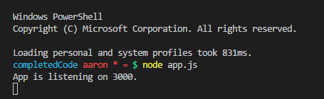

#SERVER SET UP
---
In this module we'll simply add and analyze a simple Express server. 

<hr>

### File Structure
Let's go inside of `app.js` in your `server` directory:
```
    javascript-library
        └── 4-Node-Fundamentals
        └── 5-Express-Server
            └── server
                └── .gitignore
                └── app.js
```

### Basic Server Code
In `app.js` go ahead and add the following code:
```js
var express = require('express'); //1
var app = express(); //2

//3         //4
app.listen(3000, function(){
	console.log('App is listening on 3000.')
});
```

### Analysis
Let's analyze the code:
1. Here we require the use of the express npm package that we've installed in our dependencies.
2. We create an instance of express. We're actually firing off a top-level `express()` function, a function exported by the express module. This allows us to create an express app.
3. `app.listen` will use express to start a UNIX socket and listen for connections on the given path. This method is identical to Node’s http.Server.listen().
4. The given path is localhost:3000.
5. We call a callback function when the connection happen stating a simple `console.log`.


<hr >

### Running the Code
1. Open your terminal in VS Code. Make sure you are in the server directory.
2. Type in `http-server`.
3. In your console window you should see your console message:

4. When we go to http://localhost:3000/, we will see the application running like this:


We'll explain this particular screenshot later.
