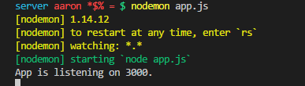

# NODEMON INTRO
---
In this module, we'll set up Nodemon for allowing us to more easily make changes to our server code.

<hr />

### Description
When you make a change to code on the client side, you just have to refresh the web page to see the effect of that change. With a server, however, it gets a little more complicated. Any changes that you make won't take effect until you stop and restart the server. When you're testing routes or endpoints and making minute changes over and over, that constant stop/start routine can get kind of ridiculous. Fortunately, we have a tool that will automatically restart your server every time you save a file: Nodemon.

<hr />

### Setup 

1. In any directory, run `npm install -g nodemon`. This installs Nodemon globally on your machine. 
2. Go into the server directory (where the `package.json` file is visible)  run `npm install --save-dev nodemon`. This saves Nodemon to your `devDependencies` in `package.json`.
3. Still in the server directory, run `nodemon app.js`. This should start the server up. You should see this:

4. The app is now running. You can stop the app with `ctrl + c`.
5. Practice running the app with Nodemon by starting it back up with the command. You can push up arrow while in your terminal to get it back quickly.  
6. With the server running and with Nodemon started, change the console.log statement in `app.js` to a new phrase. Try using this:
```js
app.listen(3000, function(){
	console.log('Hey man!!!')
});
```
7. Press save. `nodemon` should fire back up, and you should see the new `console.log()` statement in your terminal.