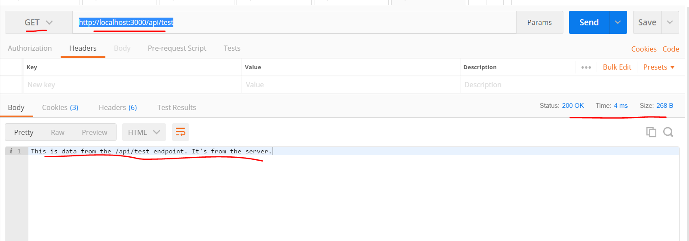

# POSTMAN PRACTICE
---
In this module we'll start to use Postman to test our application.

<hr />

### Adding a response
Let's use Postman to start testing our server by following these steps. Please know that a little bit of the code will be explained in future modules. Right now, we just want to get used to using Postman:

1. Start up the server. Again, go into the directory with `app.js` and enter the `nodemon app.js` command. Leave it running.

2. Let's go into the `app.js` file. Add the following code to the bottom of the file:

```js
app.use('/api/test', function(req, res){
	res.send("This is data from the /api/test endpoint. It's from the server.");
});
```

3. Again, we'll talk about the code soon. Keep the server running for now.
4. Open up Postman.
5. Choose `File` -> `New` -> `Request`.
6. In the request view choose `GET` from the dropdown.
7. Enter in the following url in the url input field:
`http://localhost:3000/api/test`
8. Click send.
9. You should see the following result in the Postman response window:



