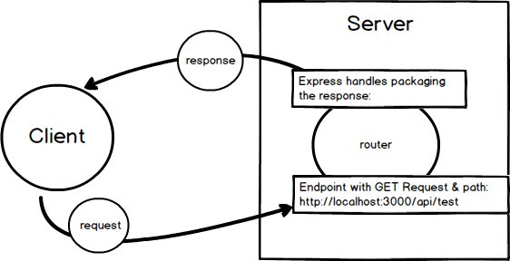

#ROUTES
---
In this module we'll introduce the concept of routes. 

<hr >

### Routing Defined
Routing refers to determining how an application responds to a client request to a particular endpoint. An endpoint is a path and a specific HTTP request method attached to that path (GET, POST, DELETE, PUT).


### Overview
Here's a rough diagram of what's happening with our recent code that was used as a test in Postman:


### Analysis
1. A GET request is made to localhost:3000/api/test.
2. When the route is requested, Express finds the method for the specific route. Here is the method that we already added for testing Postman:
```js
app.use('/api/test', function(req, res){
	res.send("This is data from the /api/test endpoint. It's from the server.");
});
```
3. So when we go to the `/api/test/` endpoint, we fire off an express function `res.send`.
4. `res` short for `response` handles packaging up the response object.
5. The `.send()` method does the job of sending off the response.
