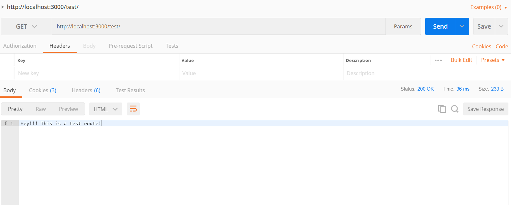
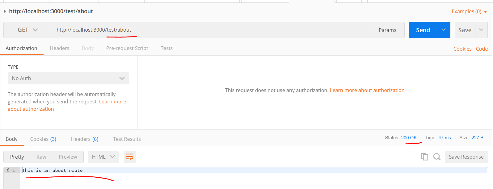

# EXPRESS ROUTES
---
In this module we'll create a few Express routes. Because an application can have dozens upon dozens of routes, the purpose of this is to help learn to create and organize our routes properly.

<hr>

### File Set up
Let's start by adding a `controllers` folder and a `testcontroller.js` file. We'll explain what controllers are later, but for now, add these two things:

```
javascript-library
    └── 7-Express Server
        └── Server
            └── controllers
                └── testcontroller.js
            └── app.js
```
<hr>
                
### testcontroller.js

1. Go into the `testcontroller.js` file.
2. Add the following imports along with the `router.get()` function. Numbers are included for upcoming analysis:

```js
var express = require('express') //1
var router = express.Router()  //2

//3    //4   //5          //6
router.get('/', function (req, res) {
    //7
  res.send('Hey!!! This is a test route!')
});

//8
module.exports = router;
```

### Analysis
Let's take a look at what this code is doing. It's somewhat of a repeat of what we did in the last module:
1. We import the express framework and store express inside `var express`, an instance of express for us to use.
2. We create a new variable called `var router`. Since the `express` variable(line 1) gives us access into the express framework, we can access express properties and methods by calling `express` + `.`. Therefore, when we call `express.Router()`, we are using the `express` variable to access the `Router()` method. <br>
The `Router()` method will return a `route` object for us. You can read about it more at the Express [docs](https://expressjs.com/en/4x/api.html#router). 

3. We use the `router` object by using the `router` variable to get access into the `Router()` object methods. 
4. `get()` is one of the methods in the object, and we call it here. This method allows us to complete an HTTP GET request. We pass two arguments into the `.get` method.
5. The first argument is the path. In this case, the path is just a `/`. More on this later.
6. The second argument is a callback function. This is also sometimes called a “handler function”. This function gets called when the application receives a request to the specified route and HTTP method. The application “listens” for requests that match the specified route(s) and method(s), and when it detects a match, it calls the specified callback function.
7. Inside our callback function we call `res.send()`. `send()` is an express method that can be called on the `res` or response object. Our response parameter is just a simple string. 
8. We export the module for usage outside of the file.

<hr >

### App.js
Before this will work, we have to add routes into `app.js`. 

1. Go to `app.js`.
2. Add the following code:

```js
var express = require('express');
var app = express();
var test = require('./controllers/testcontroller')//1

            //2            //3
app.use('/test', test) 

```

### Analysis
1. We import the route object that we just created and store it in a variable called `test`.
2. We call `app.use` and in the first parameter we create a base url called `/test`. So our base url will look like this:
`http://localhost:3000/test`
3. For our second parameter for the `use()` function, we pass in `test`. This means that all routes created in the `testcontroller.js` file will be sub-routes. It will look like this:
`http://localhost:3000/test` or `http://localhost:3000/test/`

<hr>

### Test
Let's test this now to get a better understanding.
1. Run the application using `nodemon app.js`.
2. Open Postman.
3. In the url link, add the following route into the Request URL bar:
`http://localhost:3000/test/`

4. Make sure that you have the request set to a GET request and press SEND. When you send, you should get a response like this:


<hr />

### Challenge #1
We could talk all day about this, but it won't make sense until you play around. Try the following:
1. Create a route that is the following url:
`http://localhost:3000/test/about`

2. When you test the app in Postman, you should get a response like this:


