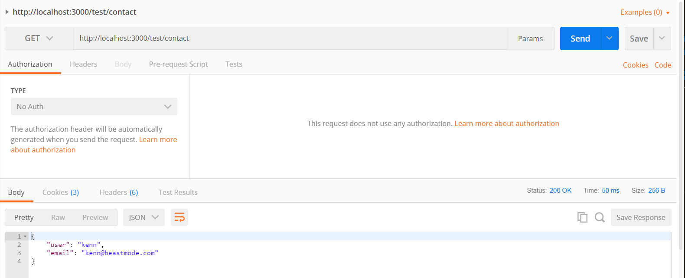
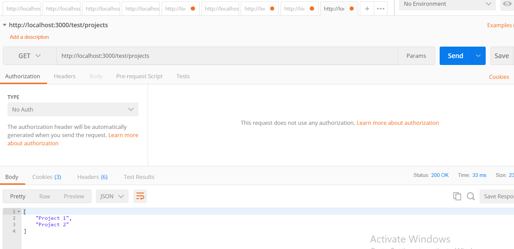
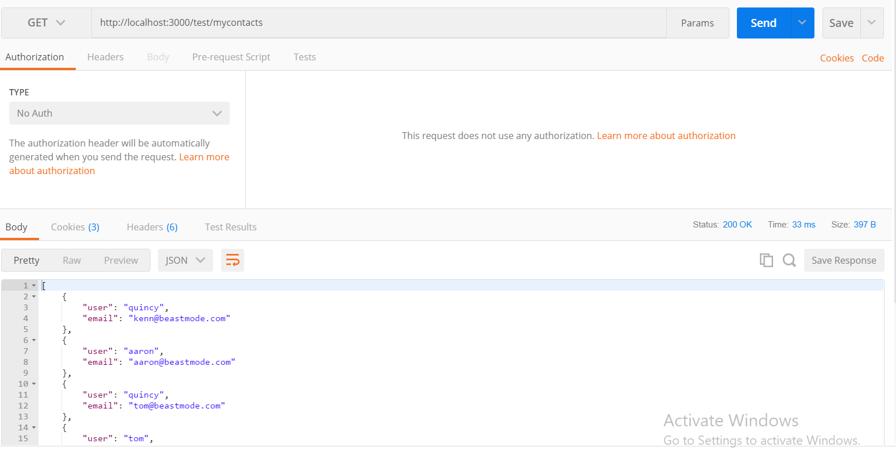

### Challenge #1 Solution:
---
In this module, we'll discuss the solution to the previous challenge and add a few more routes for practice.

<hr />

### About Route Solution
To define the route, you would have done the following in the `testcontroller.js` file:

```js
var express = require('express')
var router = express.Router()

router.get('/', function (req, res) {
  res.send('Hey!!! This is a test route!')
});

    //1        //2        //3
router.get('/about', function (req, res) {
  res.send('This is an about route') //4
});

module.exports = router;
```

<hr />

###Analysis
Just a few review notes on the challenge:
1. You can use the `router` instance that we've created and call the `.get` method from express to make a HTTP GET request.
2. The first parameter is the `/about` path that we'll be appending to the URL. This will make the url look like this:
`http://localhost:3000/test/about`
3. Again, we pass in a callback function that will run when the path is requested. So when we type in the above url, this function fires off.
4. The `send()` method gets called on the `res` object, and a simple string is returned. 

<hr />

### Challenge #2: More Practice Routes
For more practice, add three more test routes with messages of your choice: 
1. Create a route that will return a contact object.
Here is the path: `http://localhost:3000/test/contact`
2. Create a route that sends an array of projects.
Here is the path: `http://localhost:3000/test/projects`
3. Create a route that sends an array of contact objects.

Here is the path: `http://localhost:3000/test/mycontacts`


Here is the screenshot for #1:


Here is the screenshot for #2:


Here is the screenshot for #3: 


