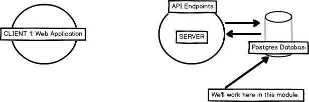

# DATABASES
---
In this module we'll discuss two types of databases, examples, and some common terms associated with them.

<hr />

### Orientation
In this module you'll be talking about some basic database concepts:


# Database types
There are two types of databases that we'll discuss here:
##1. <b>Relational:</b>

#### Rows and Columns
A relational database stores data in a table-like display, with rows and columns. Think about it like an excel spreadsheet:

|ID|Players|
|:---|:---------|
|1 |Durant      |
|2 |Barkley  |
|3 |Miller |

#### Primary Key
 Every table has something called a "primary key". Usually this "primary key" is the id column. Consider a *Breakfast of Champions* table:

|ID|Product|
|:-|:---------|
|1 |Kale      |
|2 |Broccoli  |
|3 |Cigarettes|

Each row will have a unique id, and that id is auto-generated incrementally by Postgres.


#### SQL
In addition, relational databases use SQL (Structured Query Language) to manage the information. SQL (Structured Query Language!) is most often pronounced "Sequel", but also pronounced "ESS - Q - ELL". SQL is a language of its own, using commands to create, delete, change, or display information from the database. Relational databases are often called "SQL databases" for this reason. We will teach you about SQL in a future lesson. <br>

##2. Non-Relational Databases
A "non-relational database", or "No-SQL", is usually structured like a JSON object. Rather than having tables, everything is set up like an object. Different items can have a different number of properties, or even different properties altogether. This can be useful when dealing with a large or diverse set of data. Additionally, no SQL statements are used, which helps prevent many common types of attacks against databases. Some examples of these are Firebase from Google and MongoDB.

**Example:**
Let's look at our person object in this case. We would set up the data like this:
```json
{   
    "person": {
        "1": {
            "firstName": "Aaron",
            "lastName": "Ofengender",
            "height": "70in",
            "eyeColor": "brown",
            "glasses": true
        },
        "2": {
            "firstName": "James",
            "lastName": "Smith",
            "height": "65in",
            "eyeColor": "blue",
            "glasses": false
        }
    }
}
```

# So Which are We Using?
We will be using PostgreSQL, a traditional, relational database, for this project.