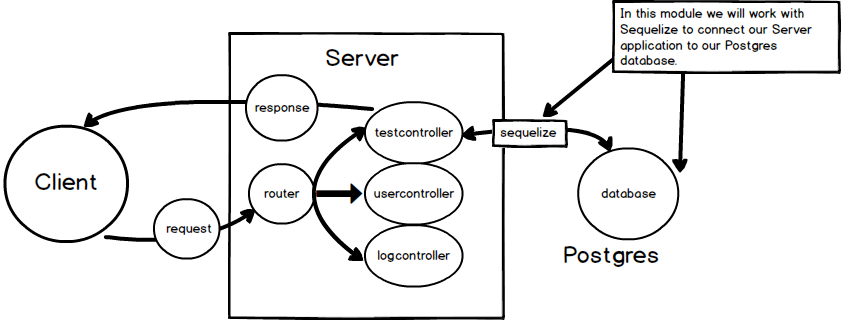

# PG INSTALL
---

In this module, we'll set up the Postgres database for our server using PG Admin and Sequelize.

### Location
We're going to be working with the database, as shown here:

### Install Directions
1. Come up with a Postgres password right now. Make it unique. Don’t make it into a password that you use for anything else. 
2. **Please take the time to record this password somewhere safe**. Resetting a Postgres password is not impossible, but is very challenging and, more importantly, very time consuming. Take the time to document this password. Several previous students have spent many hours attempting to reset their password. I use `Letmein1234!`. This will be for local use only, so there is no fear of someone else accessing your database using this password. 
3. RECORD YOUR PASSWORD SOMEWHERE!!!
4. Install postgres [here](https://www.postgresql.org/download/)
5. When the download is done, go through the install steps. <b>NOTE: You should set the port to 5432 (this is the default port number. PLEASE DO NOT CHANGE IT!!).</b>
6. After the download completes, choose PostgreSQL from the dropdown in Stack Builder.
7. Open up PG Admin 4.
    * Mac users should click on plug
8. Click Server, then click Postgres.
9. Log in with your memorable password.
10. Right click on *"Database"*.
11. Choose *"Create Database"*.
12. Name it "workoutlog".  
  

You've just created a database. We're finished with the setup, but if you have any problems with this, ask us and we’ll help. Before moving on, please make sure that others around you have been able to create a database.

