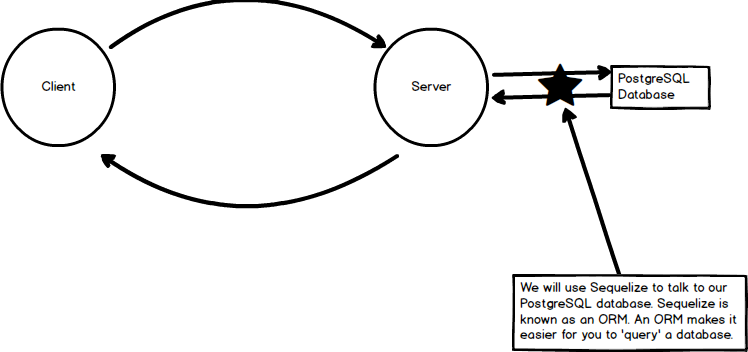
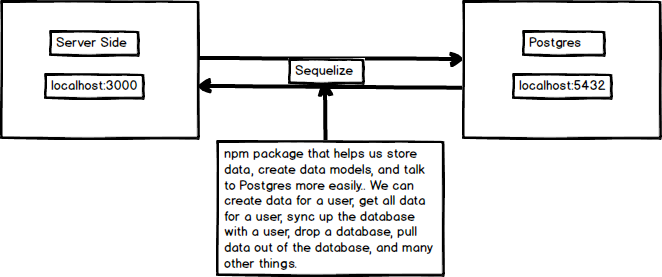

# SEQUELIZE
---

In this module we'll introduce sequelize, a tool that helps us build models to map to our database.

### Orientation
Here is where we'll be:

### What is Sequelize?
Sequelize is a promise-based ORM for Node.js. It supports different SQL dialects, including PostgreSQL, MySQL, SQLite and MSSQL. Essentially, one of the main features of Sequelize is that it allows developers to communicate between the server and the database more fluidly.

Take a minute to study the following diagram:

As you can see, Sequelize does the work of communicating between the Server application and the database. 
### Packages
If you look in your `package.json`, you'll see that we have a few packages for using Postgres and sequelize. The `sequelize` package relies on the `pg` package to connect to Postgres. 