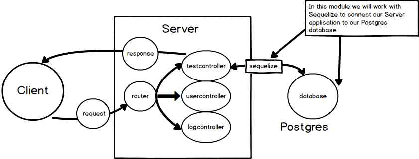

# FIRST CONNECTION
---
In this module we will use Sequelize to connect our Server to pgadmin.

<hr>


### Orientation
In this module we'll be working with Sequelize and Postgres:


### Sequelize connection
To use Sequelize, we'll have to establish a connection. This is the standard approach from the [docs](http://docs.sequelizejs.com/manual/installation/getting-started.html#test-the-connection), and it is often copy and pasted into projects for set up. Simply put, it's allowing us to connect from our project to the Postgres database. Here we do a simple breakdown of the code:

```js
//1
const Sequelize = require('sequelize');

      //2               //3       //4         //5            //6          
const sequelize = new Sequelize('workoutlog', 'postgres', 'Letmein1234!', {
	host: 'localhost', //7
	dialect: 'postgres'  ///8
});
    //9      //10         //11         
sequelize.authenticate().then(
	function() { //12
		console.log('Connected to workoutlog postgres database');
	},
	function(err){ //13
		console.log(err);
	}
);
                 //14
module.exports = sequelize;
```

### Analysis
Let's do some analysis of the code above. You do not need to memorize all of this information. Read through it, and then use it as a reference for when you need it next:

|Concept|Analysis|
|:------|:---------|
|1 |Import the Sequelize package.|
|2 |Create an instance of Sequelize for use in the module with the `sequelize` variable.|
|3 |Use the constructor to create a new Sequelize object.|
|4 |Identify the db table to connect to.|
|5 |The username for the db.|
|6 |The password for the local db.|
|7 |The host points to the localhost for sequelize. This is 5432. |
|8 |Identify the QL dialect being used. Could be MSSQL, SQLLite, too |
|9 |Use the sequelize variable to access methods.|
|10 |Call the authenticate method. |
|11 |Authenticate returns a promise. Use `.then()`.|
|12 |Fire a function that shows if we're connected.|
|13 |Fire an error if there are any errors.|
|14 |Export the module.|


### app.js
We also need to do some configuration in our `app.js` file.

Do the following:
1. Create a `sequelize` variable that imports the db file.
2. Use the variable and call `.sync()`. This method will ensure that we sync all defined models to the DB.

```js
var express = require('express');
var app = express();
var test= require('./controllers/testcontroller')
//1
var sequelize = require('./db');

//2
sequelize.sync(); // tip: pass in {force: true} for resetting tables

app.use('/test', test)

```