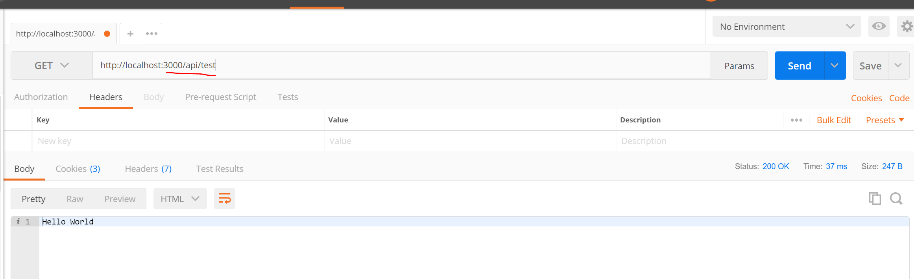

# APP.JS UPDATE
---
In this module we'll update the `app.js` file to use the headers file. 

<hr />

### Referencing the middleware
We exported the middleware, now we need to use it when we spin up our server. Follow the steps:
1. Go into `app.js`.
2. Add the following code under the `bodyParser` variable:
```js
var express = require('express');
var app = express();
var bodyParser = require('body-parser');
//1
app.use(require('./middleware/headers'));

//2
app.use('/api/test', function(req, res){
	res.send("Hello World");
});

```
### Analysis
1. When we say `app.use`, we're TODO: explain
2. We're going to make a path localhost:3000/api/test. TODO: Explain.

### Testing
Let's use Postman to test this api use the following steps:
1. Start the server using `nodemon app.js`.
2. Open up Postman.
3. Enter the URL:
`http://localhost:3000/api/test`
4. Press send in Postman. 
5. You should see the following result:

 


