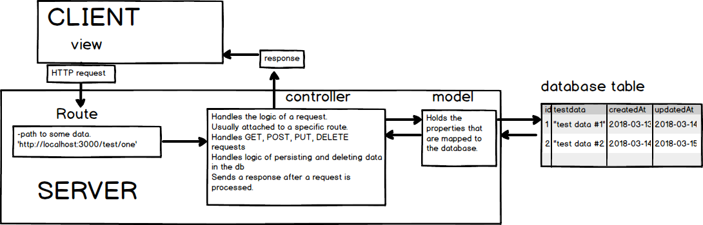

# PERSISTING DATA
---

In this chapter, we'll walk through several modules that will teach how to build controller methods and routes that make POST requests containing data that will persist in our Postgres database and reveal that data in a response. 

<hr>

### Software Pattern
We're going to be using a pattern that closely resembles something called MVC(Model, View, Controller). MVC is a common software pattern found throughout the software world and in many programming languages and applications. Take a look at a diagram of MVC to get an idea of how it works:




### Views
For this chapter, we won't be dealing with the view, but we'll say that the view will send requests, receive responses, and work to display the data to users. For a temporary view in this module we'll use Postman as view.

### Routes
We will have a number of routes in this chapter that we'll be use them as our `endpoints` for making a request. Here are the endpoints:

```
http://localhost:3000/test/one
http://localhost:3000/test/two
http://localhost:3000/test/three
http://localhost:3000/test/four
http://localhost:3000/test/five
http://localhost:3000/test/six
http://localhost:3000/test/seven
```

When we start up our server each of these will be available for processing a request. We'll work with each one as a way to learn the process of writing a controller method.

### CONTROLLERS
It's good to think of the controller as something that handles the heavier logic in the application. A controller is usually a method or methods that will handle some of the following things:
1. Receiving the incoming request depending on the route.
2. Processing the type of incoming request: GET, POST, PUT, DELETE.
3. Collecting the data from the incoming request.
4. Working with the model to ensure that the request data matches the types in the model and the database. 
5. Creating, updating, reading, or deleting objects in the database. 
6. Sending off the response for the incoming request. 

### MODELS
Coding models are usually considered to be just this: `representations of the data being handled`. Models can do the following:
1. Represent the data being stored in the database. 
2. Dictate the types of data that will be stored(string, boolean, integer)
3. Handle some basic business logic in an application, for instance, character limit for a string being stored in the db, formatting for date and time details, and many other things that shape the data in the database.
4. Used by the controller to handle logic.


Let's do some work with these things to get a better idea of this MVC pattern. We'll start by looking at models.


