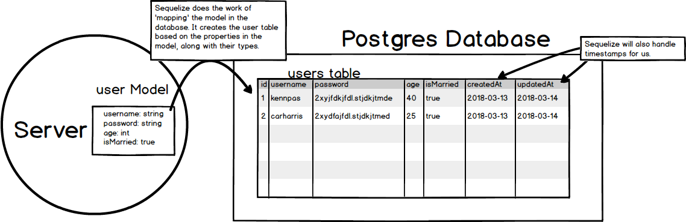

# MODELS
---
In this module, we discuss why we need models in our MVC application.

### Rationale
Essentially, we will use models to define the data that we want to store. The model in our server will closely mirror the data table in our database. Consider the following diagram:

Notice how the user model in the server has the following properties: `username`, `password`, `age`, and `isMarried`. These are all properties of a user model that will eventually show up in the database. Notice how the Postgres database table has columns for these properties.

The model and the db table are not exactly the same though. Sequelize will do the following under the hood:
1. Add an id that increments automatically and without repeating (1, 2, 3, 4, etc.)
2. Add a timestamp for when the row was created.
3. Add a timestamp for when the row is updated.  

Let's start learning how to configure a model with a db table by building our own test model. 