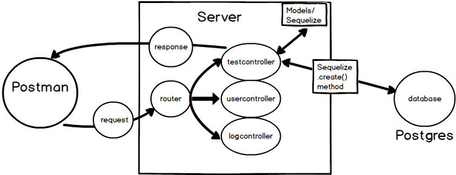

# CONTROLLER INTRO
---

In this module, we'll reiterate the purpose of our controller methods and give an overview of the next seven modules.

### Key Points
It's good to think of a controller as something that handles or 'controls' the heavier logic in the application. A controller is a method or methods that will handle some or all of the following things:

1. Receiving the incoming request depending on the route.
2. Processing the type of incoming request: GET, POST, PUT, DELETE.
3. Collecting the data from the incoming request.
4. Working with the model to ensure that the request data matches the types in the model and the database. 
5. Creating, updating, reading, or deleting objects in the database. 
6. Sending off the response for the incoming request. 

### Final Flow
So far, in previous modules, we've made GET requests with HTTP. We have made requests that ask the server to send us some hard coded data in a response. Now, we want to work towards using Postgres to store data that a user might send to it in a POST request. Clearly, we want to be able to do this so that our users can save data and come back to it later. 

Let's look at the final flow of how this will work. We will build towards the items in this diagram as we go:

That will be the completed flow after we create all of our endpoints and controller logic. 

Let's get started on discussing how to build controller methods and use them to POST data and persist it to our database.

