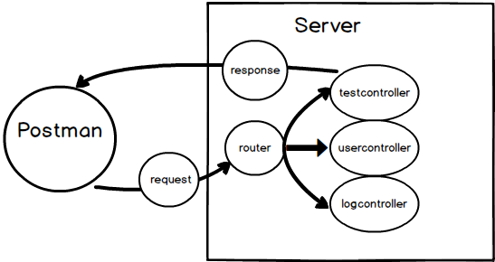
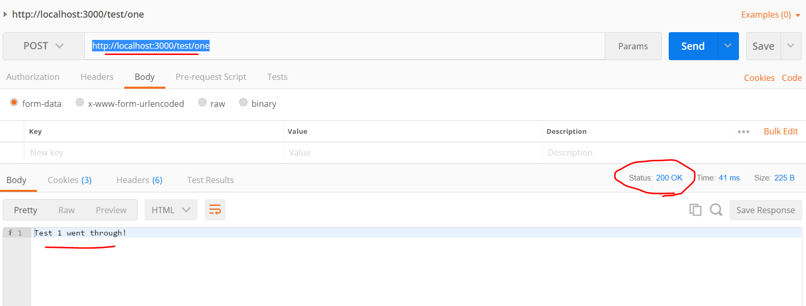

# ENDPOINT ONE
---
In this module we'll get started on an endpoint that handles a simple POST request. 

<hr />

### Overview
Here's the flow of what we will have after this module:



Notice that there is no database or models at this point.

### Location
We're going to be adding to our `testcontroller.js` file that we built in the back in our lessons on routing.
```
javascript-library
    └── 5-Express Server
        └── Server
            └── controllers
              └── testcontroller.js
            └── models
            └── app.js
            └── db.js
```

<hr />

### Code

Before proceeding, please clear out all previous test methods in `testcontroller.js`.  Add the following items to the file:

```js
var express = require('express')
var router = express.Router()
var sequelize = require('../db');

/****************************************
 * Controller Method #1: Simple Response
****************************************/
      //1       //2           
router.post('/one', function(req, res){
  //3
  res.send("Got a post request.") 
})
```

<hr >

### Analysis
1. We use the express router object to call the `post()` method. This corresponds to the type of HTTP request that we are sending. `POST` is telling the server that the incoming request has data coming with it. You use a POST request when you sign up for an application, send an email, send a tweet, post on a wall. POST sends data through HTTP to the server which might send the data to the database to be stored.

2. `one` will be the endpoint/route we are using. Our route will be named `http://localhost:3000/test/one`. After that we call a callback function which will fire off a response.

3. When the client requests the given endpoint, we simply send a string in our  response.

<hr />

### Test
Let's test this in Postman.
1. Make sure your server is running.
2. Open Postman.
3. Enter the enpoint into the URL and press 'Send'.
4. You should see the response:
