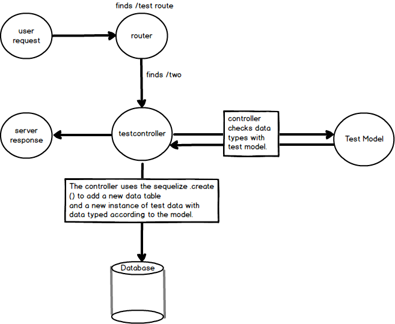

# CREATE METHOD
---

Now that we know our route works, let's test our model. In this test, the data that will be sent through the model has already been provided.
<hr>


### Code
Let's write a controller method:
```js
var express = require('express')
var router = express.Router()
var sequelize = require('../db');
var TestModel = sequelize.import('../models/test'); //1

router.post('/test/two', function (req, res) {
  let testData = "Test two"; //1

  TestModel //2
    .create({
      testdata: testData //3
    })
  console.log("Test two went through.")
});
```

<hr >

### Analysis
1. We import the test model. This tells sequelize how much data the table requires and the data-types of each.

1. Some fixed test data that we're going to use in our model.

2. The model that we are using. This is also the table in which the data will be inserted.
3. The column being used in the table and the data to be placed in that column. In other words: `{column: data}`

### Screenshot
Here's a screenshot to give you an idea of the flow here:


### Challenge
Create a request to the endpoint above. We are not sending a response back at the moment, so Postman may get stuck on "Waiting for Response". Check the database to see if the request succeeded. In PG Admin, click the following: `workoutlog --> schemas --> tables`. Then right-click on `test`, hover over `View/Edit Data`, then choose `All Rows`. If successful, you should see something like

