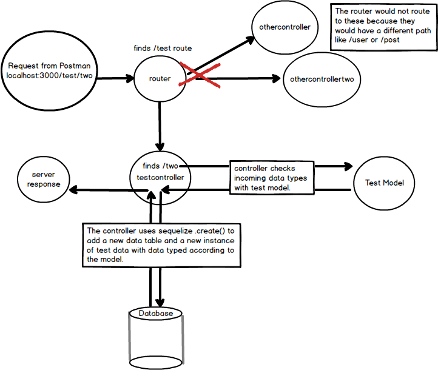
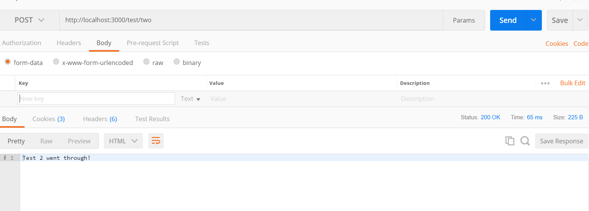
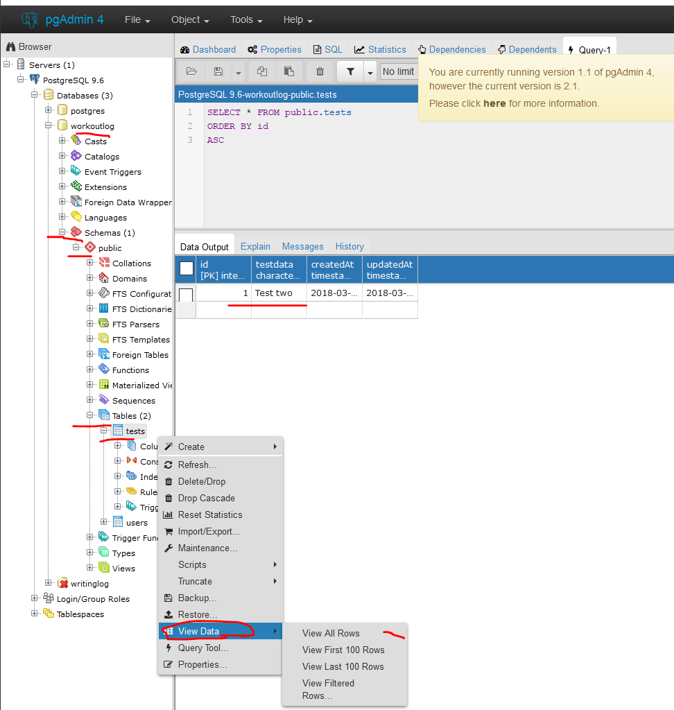

# CREATE METHOD
---
In this module, we're going to create a second endpoint that accepts a POST with data, matches the request with a model, passes the data to Postgres, and sends a response.

<hr />

## Overview
Here's the flow of what we will have after this module:



Don't be overwhelemed. Notice that we've added usage of our model and our database.

<hr>


### Code
Now that we know a POST route works, let's add in our model and our database in another controller method. This time you'll need to import the `test.js` model. You'll put the next controller method underneath the first one inside `testcontroller.js`:
```js
var express = require('express')
var router = express.Router()
var sequelize = require('../db');
var TestModel = sequelize.import('../models/test'); //1

/****************************************
 * Controller Method #1: Simple Response
****************************************/
router.post('/one', function(req, res){
  res.send("Got a post request.") 
});

/****************************************
 * Controller Method #2: Persisting Data
****************************************/
router.post('/two', function (req, res) {
  let testData = "Test data for endpoint two"; //2

  TestModel //3
    .create({ //4
        //6
      testdata: testData //5
    })
  res.send("Test two went through!")
});

module.exports = router;
```

### Analysis
1. We import the test model and store it in `TestModel` variable. It is convention to use Pascal casing (uppercase on both words) for a model class with Sequelize. You'll find this to be true in other programming languages as well.

2. `testData` is going to have a fixed string that we'll use every time a POST request comes in. 

3. We use the `TestModel` variable to access the model that we are using. This will grant us access to the `Test` model properties and to Sequelize methods. 

4. `.create()` is a Sequelize method that allows us to create an instance of the `Test` model and send it off to the db, as long as the data types match the model.

5. We pass the value of `testData` down to satisfy the key/value pair for the model. The string that we are sending will be the value that's stored in the variable. Currently, it is the string `Test data for endpoint two`;

6. `testdata` is the key in the object, and it represents the column being used in the table.

Let's test this code in Postman and do some more work that should clarify this process.


<hr />

### Test
1. Make sure your server is running.
2. Open Postman.
3. Open a new request. 
4. Change the dropdown to POST.
5. Enter the endpoint into the URL: `http://localhost:3000/test/two`.
6. Press 'Send'.
7. You should see the following response:


<hr />

### Checking the Database
Guess what? We also should have just persisted our data to Postgres. Let's check using the following steps:
1. Open PGAdmin. (The elephant)
2. Find your `workoutlog` database.
3. Find `Schemas` dropdown.
4. Navigate your way to `Tables`.
5. You should see the `tests` table.
6. Right click on it, then click `View Data` -> `View All Rows`.
7. You should see the following. Note that we have underlined all of these steps in the image:


<hr />

### Summary of the Flow
In this module, the following flow is happening:
1. We make a POST request with Postman.
2. The router sends that request to the `testcontroller`.
3. The `testcontroller` method contains a variable called `testData` that has a string in it.
4. Our `testcontroller` method access the `TestModel`.
5. We then use the Sequelize `create()` method to create the object to be sent to the DB.
6. The object is sent and Postgres stores it. 
7. The controller sends a response to Postman.

There is a lot going on now, but we still need to iterate and add more endpoints, routes, and controller steps to see how a full controller method should be built.