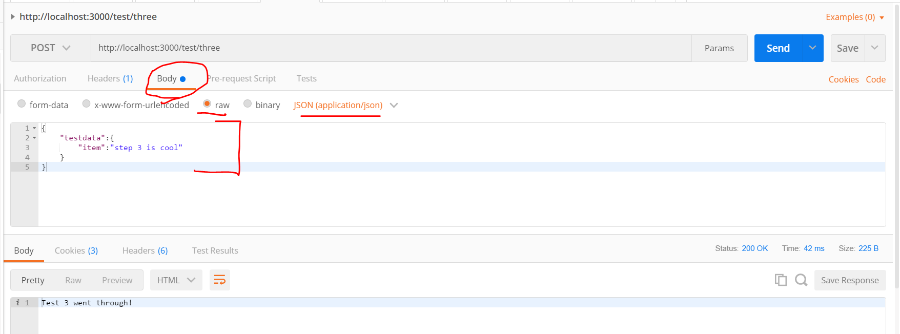
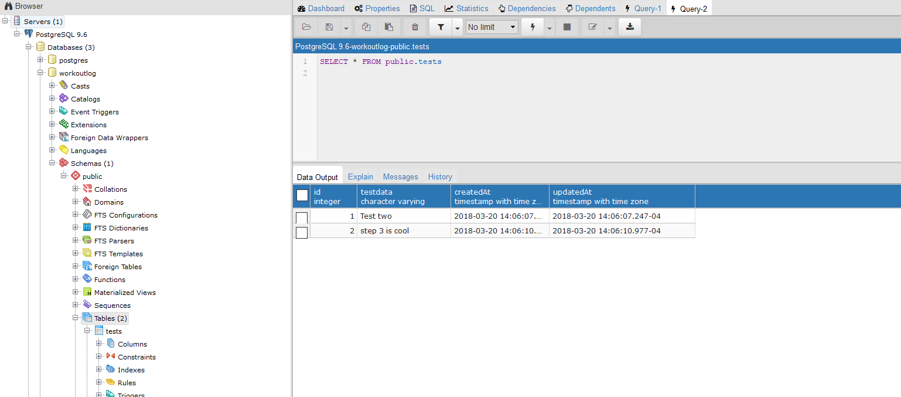

# REQ.BODY()
---
In this module, we'll set up our Express application so that it can take incoming requests properly.

<hr />

### Overview
Hopefully, your model works, and you were able to put something in the database. That's great, but if we continue doing a POST request, we would send the same string every time. This one:
```js
let testData = "Test data for endpoint two";
```

We definitely want to be more versatile with incoming requests. To do that, we need another tool called `body-parser`, and we want to use the `req.body` middleware tool provided by Express. This is confusing, so let's step through it slowly.

<hr>

### The Code
Go into the `testcontroller.js` file and add the following method. Add it to the bottom of the file, above the export statement:

```js
/****************************************
 * Controller Method #3: req.body
****************************************/
router.post('/three', function (req, res) {
                  //1
  var testData = req.body.testdata.item; 

  TestModel
    .create({ //2
      testdata: testData
    })
  res.send("Test three went through!")
  console.log("Test three went through!")
});

module.exports = router;
```

1. Here we use the `req.body` middleware provided by Express and append two more properties to it. This is what we're sending to the database. `req` is the actual request, and `body` is where our data is being held. `testdata` is a property of `body`, while `item` is a property of `testdata`. We'll see this in Postman in a little while.

2. `create()` is a Sequelize method. It creates a SQL statement that will insert our data into the database. You'll learn more about SQL later.

<hr />

### body-parser
In order to use the `req.body` middleware, we need to use a middleware package called `body-parser`. We installed this earlier. Go into `app.js` and add the following code:

```js
var express = require('express');
var app = express();
var test = require('./controllers/testcontroller')
var sequelize = require('./db');
var bodyParser = require('body-parser'); //1

sequelize.sync(); // tip: {force: true} for resetting tables

app.use(bodyParser.json()); //2

app.use('/test', test)

app.listen(3000, function(){
	console.log('App is listening on 3000.')
});

```

### Analysis
1. We pull in the `body-parser` library and store it in the `bodyParser` variable.

2. This `app.use` statement MUST go above any routes. Any routes above this statement will not be able to use the `bodyparser` library, so they will break. You should read through [this article](https://medium.com/@adamzerner/how-bodyparser-works-247897a93b90) to get a starter understanding of how `body-parser` is working with `req.body`. Warning: this will lead you down a rabbit hole of understanding. For our purposes, it's important to know this: 

> `app.use(bodyParser.json())` tells the application that we want `json` to be used as we process this request.

[Here](https://stackoverflow.com/questions/38306569/what-does-body-parser-do-with-express) is a little more information on `body-parser`.

<hr />

### Testing
1. Make sure your server is running.
2. Open Postman.
3. Open a new request. 
4. Change the dropdown to POST.
5. Enter the endpoint into the URL: `http://localhost:3000/test/three`.
6. Click on the body tab under the url input field.
7. Choose the `raw` radio button. 
8. In the dropdown, choose `JSON (application/json)`.
9. In the empty space, add a JSON object like the one below. Notice that this is `testdata.item`, the last two properties in `req.body.testdata.item`. This information is inside `body`, which is inside `req`.
```json
{
    "testdata":{
        "item":"step 3 is cool"
    }
}
```
10. Press send.
11. You should see the following


12. Let's also go to Postgres and make sure the data is there. To update the table, you can press the `Execute` button (the lightning bolt). 



<hr />

### Summary of the Flow
In this module, the following flow is happening:
1. We make a POST request with Postman.
2. `body-parser` breaks the request into JSON.
3. The router sends the request to the `testcontroller`.
4. The controller with the `/three` endpoint is called.
5. The `req.body.testdata.item` is captured in the `testData` variable. 
6. We then use the Sequelize `create()` method to create the object to be sent to the DB.
7. The object is sent, and Postgres stores it. 
8. The controller sends a response to Postman.
