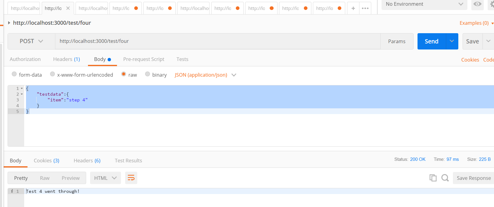
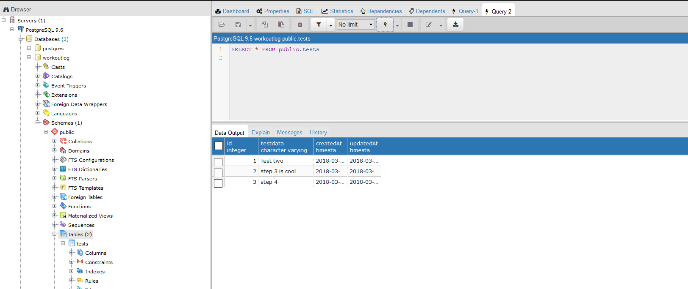

# CRAFTING THE RESPONSE
---
In this module, we'll use the `then()` function to return a Promise for our request.

<hr />

### Overview
It's great that our model and routes are working, but there was a slight hiccup with our last post: If you look at the console, you'll see that the success message actually printed BEFORE the data was inserted into the database. What if the insert had failed though and the data couldn't be entered? For this reason, we need to make sure that the response to the user comes AFTER the insert statement. 

<hr>

### The Code
Go into the `testcontroller.js` file and add the following method. Add it to the bottom of the file, but above the export statement. 
```js

//STEP 4 - Use this with Postman
router.post('/four', function (req, res) {
  var testData = req.body.testdata.item;
  TestModel
    .create({
      testdata: testData
    })
    .then( //1
      function message() { //2
       res.send("Test 4 went through!");
      }
    );
});

```
<hr />

### Analysis
Here are the updates that we've made:
1. We call the `then()` method. As you'll read in the the MDN docs, the `then()` method returns a Promise. Hence, we use this asynchronous function to force the message to wait for the insert statement to finish.
2. The callback function will print the success message to the console once `testData` is done running.

<hr />

### Testing
Let's use Postman to test this:
1. Make sure your server is running.
2. Open Postman.
3. Open a new request. 
4. Change the dropdown to POST.
5. Enter the endpoint into the URL: `http://localhost:3000/test/four`.
6. Click on the body tab under the url input field.
7. Choose the `raw` radio button. 
8. In the dropdown, choose `JSON (application/json)`.
9. In the empty space, add a JSON object like the one below:
```json
{
    "testdata":{
        "item":"step 4"
    }
}
```
10. Press send.
11. You should see the following:

12. Let's also go to Postgres and make sure the data is there. To update the table, you can press the `Execute` button (the lightning bolt). 



<hr />

### Summary of the Flow
In this module, the following flow is happening:
1. We make a POST request with Postman.
2. `body-parser` breaks the request into JSON.
3. The router sends the request to the `testcontroller`.
4. The controller with the `/four` endpoint is called.
5. The `req.body.testdata.item` is captured in the `testData` variable. 
6. We then use the Sequelize `create()` method to create the object to be sent to the DB.
7. The object is sent to Postgres, which stores it. 
8. After the data is stored, we fire the `then()` method, which returns a Promise.
9. A method fires a response to Postman.

