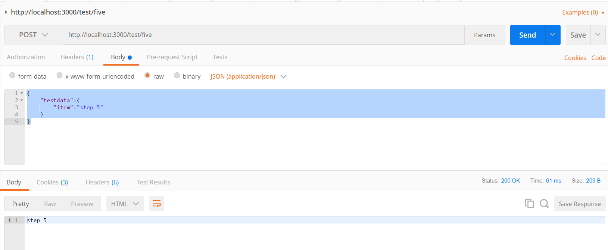
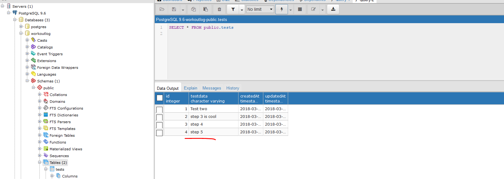

#TEST POST FIVE
---
In this module we'll pass the request data back in our callback function

<hr />


### Overview
We now have a proper sequence, but the way we displayed the success message might not be what we want. We actually are probably going to want the data to be sent back to us after it's been saved in the db. The current response - `res.send("Step four");` is in no way really connected to the actual data. What if, for instance, we were saving an item to a To Do list? We would want the data to save, and then we would want to get it in our response. Let's pass some the data into the callback to provide a more detailed response to the user.

<hr>

### The Code
Go into the `testcontroller.js` file and add the following method. Add it to the bottom of the file, but above the export statement. 

```js
/*********************
 * Route 5: Return data in a Promise
 **********************/
router.post('/five', function (req, res) {
  var testData = req.body.testdata.item;
  TestModel
    .create({
      testdata: testData
    })
    .then(              //1
      function message(testdata) {
        res.send(testData);  //2
      }
    );
});
```
1. It's important to note that the `.then()` method is chained to `.create()`. In fact, the whole expression could be read like this, in one line:
```js
TestModel.create({testdata: testData}).then(function message(testdata) { res.send(testData);});
```

2. With that idea in mind, we have changed the data coming back in the response to the data that was persisted in Postgres. To be clear, after the data is persisted in the Postgres with the `.create()` method and in the `testdata` column, the `.then()` method returns a Promise that fires up a callback function holding the data that was just added. 

It's important to note that the `testData` parameter can have any name that we want.  

<hr >

### Testing
Let's use Postman to test this:
1. Make sure your server is running.
2. Open Postman.
3. Open a new request. 
4. Change the dropdown to POST.
5. Enter the endpoint into the URL: `http://localhost:3000/test/five`.
6. Click on the body tab under the url input field.
7. Choose the `raw` radio button. 
8. In the dropdown choose `JSON (application/json)`.
9. In the empty space add a JSON object like the one below:

```json
{
    "testdata":{
        "item":"step 5"
    }
}
```
10. Press send.
11. You should see the following:


12. Notice that the data in the response matches the data in the request. 
13. You should also go to Postgres and make sure the data is there and that the `testdata` column matches the request and response:



