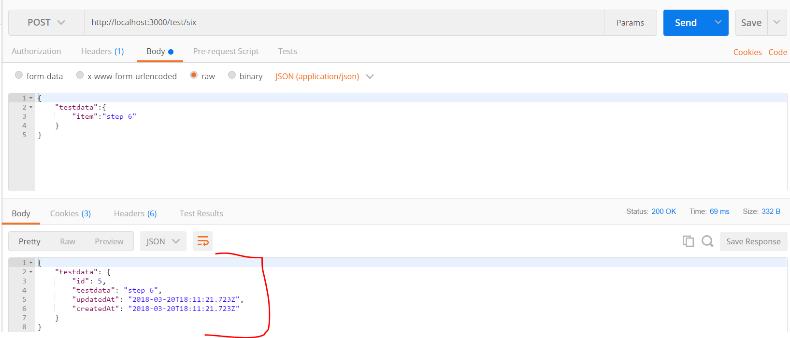
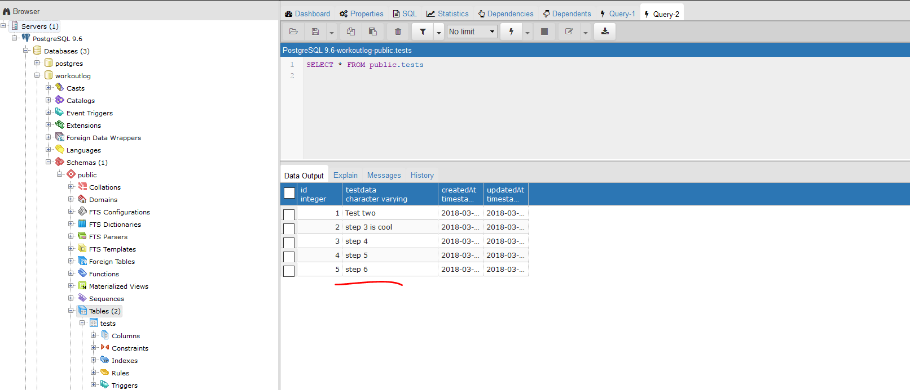

#TEST POST SIX
---
In this module we'll return the response as JSON instead of a simple string. 

<hr />

### Overview
We now have a proper sequence and a response with some of the stored data, but what if we want to know when the data was stored? We have that in the information in the database, and currently it is not coming back in the response. How do we do that? Let's look.

<hr>

### The Code
Go into the `testcontroller.js` file and add the following method. Add it to the bottom of the file, but above the export statement. 

```js
/*********************
 * Route 6: Return response as JSON
 **********************/
router.post('/six', function (req, res) {
  var testData = req.body.testdata.item;
  TestModel
    .create({
      testdata: testData
    })
    .then(
      function message(testdata) {
        res.json({ //1
          testdata: testdata  //2
        });
      }
    );
});
```
<hr >

### Analysis
1. In our callback, rather than `res.send()`, we will invoke the `.json()` method. This will, of course, package our response as json.
3. The same object that was added to the database is now being sent back to the client and stored in a `testdata` property.

<hr >

### Testing
Let's use Postman to test this:
1. Make sure your server is running.
2. Open Postman.
3. Open a new request. 
4. Change the dropdown to POST.
5. Enter the endpoint into the URL: `http://localhost:3000/test/six`.
6. Click on the body tab under the url input field.
7. Choose the `raw` radio button. 
8. In the dropdown choose `JSON (application/json)`.
9. In the empty space add a JSON object like the one below:

```json
{
    "testdata":{
        "item":"step 6"
    }
}
```
10. Press send.
11. You should see the following:


12. Notice that the data in the response matches the data in the request, but we are also getting back a full JSON object from the database, including timestamp data. 
13. You should also go to Postgres and make sure the data is there and that the `testdata` column matches the request and response:



