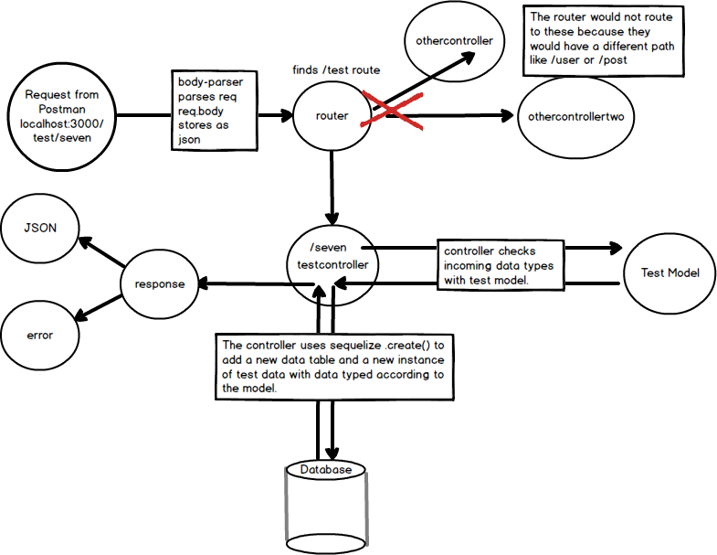

# CONCLUSION
----

In this module, we'll take a look back at what we've done.

### Overview
In Section 5, we've done the following:

1. A step-by-step creation of a POST controller method.
2. Learned about passing data to our database. 
3. Gained experience with using Postman to test HTTP requests and responses. 
4. Begun working with the Model-View-Controller software pattern.
5. Learned more about Promises and used them in a practical way.
6. Worked with Sequelize methods and models to help create data to be persisted.

### Diagram
Let's take a look at the big picture diagram:

### Moving On
This chapter will be the foundation for a pattern that we will continually use as we build out our server side. A good way to learn to code is to work through bite-sized chunks, referencing the documentation, and playing with test data, all of which we have been doing. Although a good amount of heavy lifting has been done, we have only just begun.  As the controller method that we wrote in seven steps becomes second nature to you, you'll see that learning is a continuous requirement in our field.