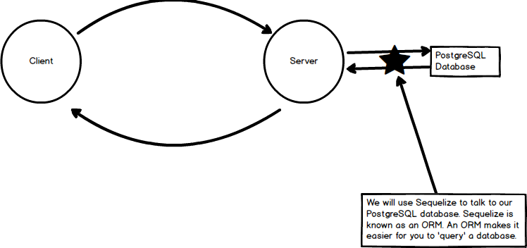
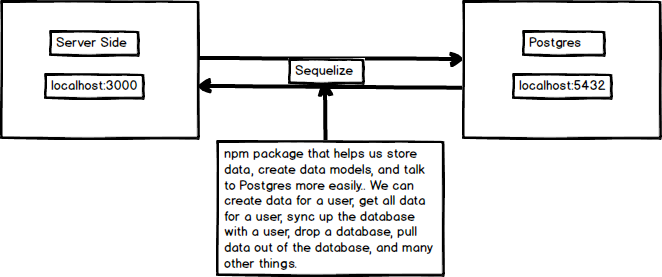

# SEQUELIZE
---

In this module we'll introduce sequelize, a tool that helps us map our database.

### Orientation
Here is where we'll be:

### What is Sequelize?
Sequelize is a promise-based ORM for Node.js. It supports different SQL dialects, including PostgreSQL, MySQL, SQLite and MSSQL. Essentially, Sequelize one of the main features is that it allows developers to communicate between the server and the database more fluidly.

Take a minute to study the following diagram:

### Packages
If you look in your `package.json`, you'll see that we have a few packages for using Postgres.

TODO: discuss these packages:
pg-hstore
pg
sequelize
