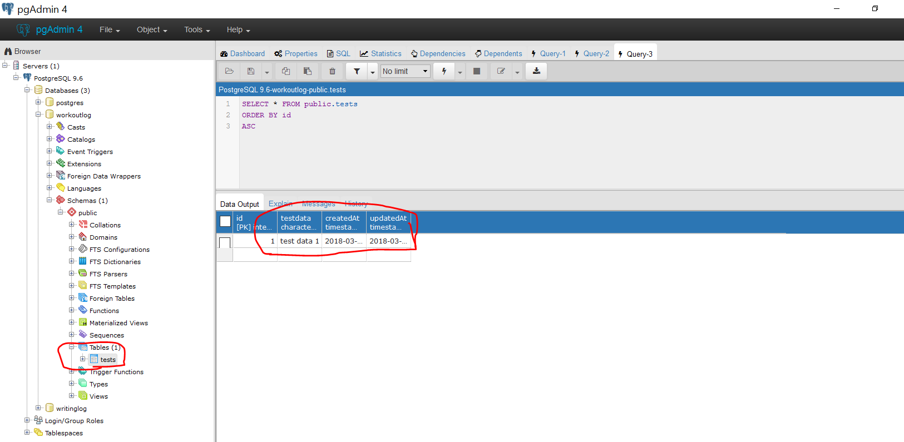

# TEST POST TWO
---

Now that we know our route works, let's test our model. In this test, the data that will be sent through the model has already been provided.
<hr>


### SOLUTION
Use this with Postman

```js
router.post('/testpost/two', function (req, res) {
  let testData = "Test two"; //1
  console.log(req); //2
  TestModel //3
    .create({
      testdata: testData //4
    })
  console.log("Test two went through.")
});
```

<hr >

### Analysis

1. The fixed test data that we're going to use in our model.
2. Print the request to the console. Once we start reading data from some input, this will show if that data is being passed properly
3. The model that we are using. This is also the table in which the data will be inserted.
4. The column being used in the table and the data to be placed in that column. In other words: `{column: data}`

### Challenge
Create a request to the endpoint above. We are not sending a response back at the moment, so Postman may get stuck on "Waiting for Response". Check the database to see if the request succeeded. In PG Admin, click the following: `workoutlog --> schemas --> tables`. Then right-click on `test`, hover over `View/Edit Data`, then choose `All Rows`. If successful, you should see something like

