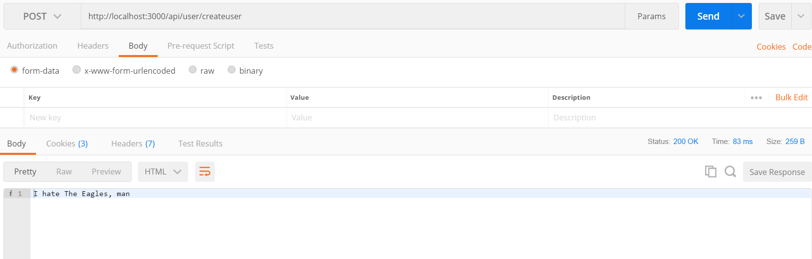
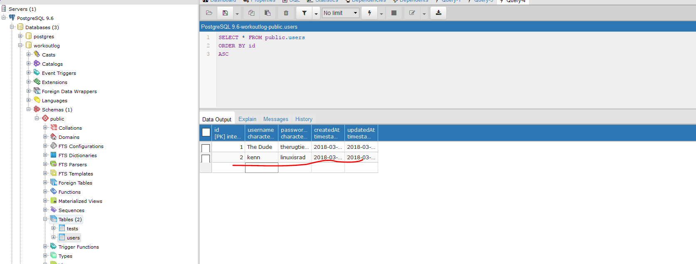

# USER CREATE
---
In this module we'll start to set up the necessary items for creating a new user. 

<hr />

So far, we've just been putting data into a table in our database. However, if someone were to look at that data, there's no way to tell who actually put the data there. Additionally, there's no security protocols in place, so anyone can connect to the database and modify its contents in whatever way they choose. We can use JWT to fix both of these issues. We have a little bit of prep to do first, though: We'll use Sequelize and create a User model to create a new user in the database. 

<hr />

### User Model

Let's set up a new user model.

```js
module.exports = function (sequelize, DataTypes) {
    return sequelize.define('user', {
        username: DataTypes.STRING,
        passwordhash: DataTypes.STRING
    });
};
```

### Analysis
This should look familiar:
1. A function with a sequelize object that calls the `define` method.
2. A first parameter that will create a `users` table in Postgres.
3. An object with `username` and `passwordhash` that will be the columns in the table.

<hr />

### App.js
We'll need to set up a route to the user controller methods in `app.js`. We have added the entire file for orientation:
```js
var express = require('express');
var app = express();
var test= require('./controllers/testcontroller')
var user = require('./controllers/usercontroller') //1
var sequelize = require('./db');
var bodyParser = require('body-parser');

sequelize.sync(); // tip: {force: true} for resetting tables

app.use(bodyParser.json());

app.use('/test', test);

app.use('/api/user', user); //2

//3 You could also write it this way without the require statement above.
//app.use('/api/user', require('./controllers/usercontrollers'));

app.listen(3000, function(){
	console.log('App is listening on 3000.')
});

```

### Analysis
1. We import the `usercontroller.js` file.
2. We set up a route to the endpoints for the `api/user` route.
3. Just another way to write out your routes. Just be consistent.

<hr />

### usercontroller.js
We'll need to add some code in our `usercontroller.js` file. Note, if Lebowski isn't your style, enter in your own flavor for the string values:

```js

var express = require('express')
var router = express.Router()      //1
var sequelize = require('../db');
var User = sequelize.import('../models/user'); 

/*************************
** Create User Endpoint: Starter***
**************************/
//2
router.post('/createuser', function (req, res) {

  var username = "The Dude";
  var pass = "therugtiedtheroomtogether";               /**3**/

  User.create({
    username: username,
    passwordhash: pass

  }).then(
    function message(){
      res.send("I hate The Eagles, man");
    }
  );
})

module.exports = router;
```

### Analysis
This should look familiar again:
1. We bring in our necessary imports. Same as the testcontroller, just with a User model now.
2. We start out our post method for a `createuser` endpoint.
3. Inside the method, we have the basics for creating a new user and returning a message in the response. 

### Postman
Let's quickly test this with Postman.
1. Start your server then open Postman. 
2. Figure out the endpoint to send a post request to. 
3. Press send.
4. You should see the response string:


### Postgres
You should also go check Postgres to see that the data showed up:


<hr />
