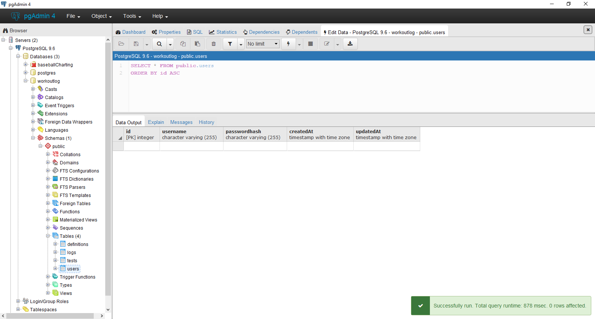
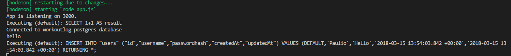
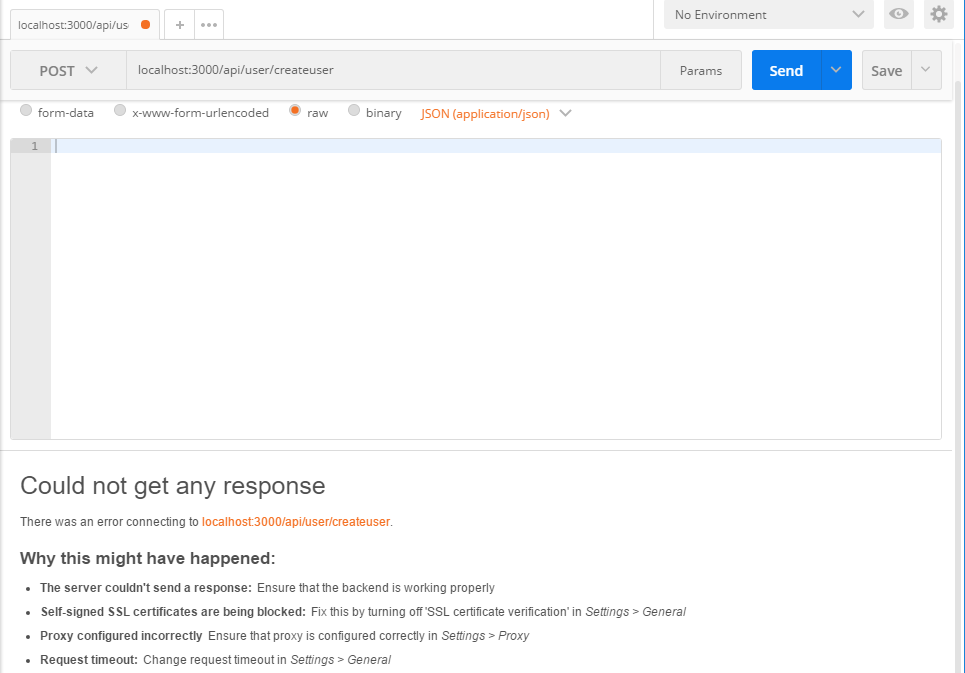

# USER CREATE
---
So far, we've just been putting data into a table in our database. However, if someone were to look at that data, there's no way to tell who actually put the data there. Additionally, there's no security protocols in place, so anyone can connect to the database and modify its contents in whatever way they choose. We can use JWT to fix both of these issues. We have a little bit of prep to do first, though: We'll use Sequelize and our User model to create a new user in the database. 

<hr />

### CreateUser Route
In order to create a user, we first have to set up a new route, which we'll call `createuser`. We'll create a simple sign up process, only requiring a username and a password. For testing purposes, we'll hard-code the values for each right now. Just like we imported the `test` model previously, we now import the `user` model. This forces any new user to conform to the model, as well as tell the database where to put the new data. Notice that we don't have any response to tell us if it worked right now.

```js
var express = require('express')
var router = express.Router()
var sequelize = require('../db');
var User = sequelize.import('../models/user');
var TestModel = sequelize.import('../models/test');

/***************
** HOME PAGE***
**************/
router.get('/', function (req, res) {
  res.send('This is a home page');
});

/*************************
** Create User STEP ONE***
**************************/
router.post('/createuser', function (req, res) {

  var username = "User Dude";
  var pass = "Hello";

  User.create({
    username: username,
    passwordhash: pass

  }).then(
    console.log("hello")
  );
})

module.exports = router;
```

### POSTMAN
Now that our route is set up, we can test it with Postman. First, though, open up your database in PG Admin and look at the data in the `users` table. It should be blank, like 
<br> <br>

Start your server then open Postman. Send a post request to the `createuser` route. Because we hard-coded the values for `username` and `password`, we don't actually have to include anything in the body section at the moment. You should see something like the following in Postman, PG Admin, and the console: <br>
<br>
<br>
<br>

Sometimes Postman will be stuck at "Waiting for response", because we aren't actually sending a response, and sometimes it might say that it couldn't connect to the database. We'll take care of that in a moment, but as long as you see the user in the table in PG Admin, you're fine.


```js
//STEP 4
router.post('/createuser', function (req, res) {

  var username = req.body.user.username;
  var pass = req.body.user.password;

  User.create({
    username: username,
    passwordhash: pass

  }).then(
    //Sequelize is going to return the object it created from db.

    function createSuccess(user) {
      // var token = jwt.sign({id: user.id}, "i_am_secret", {expiresIn: 60*60*24});

      res.json({
        user: user,
        message: 'created'
        // sessionToken: token
      });
      console.log("**********USER:", user);
    },
    function createError(err) {
      res.send(500, err.message);
    }
  );
});

module.exports = router;
```
```js
//STEP 4
// router.post('/', function(req, res) {
// 		var username = req.body.user.username;
// 		var pass = req.body.user.password;
// 		//Need to create a user object and use sequelize to put that user into

// 		User.create({
// 			username: username,
// 			passwordhash: bcrypt.hashSync(pass, 10)
// 		}).then(
// 		//Sequelize is going to return the object it created from db.

// 			function createSuccess(user){
// 			    var token = jwt.sign({id: user.id}, "i_am_secret", {expiresIn: 60*60*24});

// 				res.json({
// 						user: user,
// 						message: 'created',
// 						sessionToken: token
// 				});
// 			},
// 			function createError(err){
// 				res.send(500, err.message);
// 			}
// 		);
// 	});

// module.exports = router;


// // var router = require('express').Router();
// var sequelize = require('../db.js');
// var User = sequelize.import('../models/user');
// var bcrypt = require('bcryptjs');
// var jwt = require('jsonwebtoken');

//Write the post method:
// router.post('/', function(req, res){
//     //1
//     var username = req.body.user.username;
//     var pass = req.body.user.password;
// })

//1 Explain how req.body is part of express.


// router.post('/', function(req, res) {
// 		var username = req.body.user.username;
// 		var pass = req.body.user.password;
// 		//Need to create a user object and use sequelize to put that user into

// 		User.create({
// 			username: username,
// 			passwordhash: bcrypt.hashSync(pass, 10)
// 		}).then(
// 		//Sequelize is going to return the object it created from db.

// 			function createSuccess(user){
// 			    var token = jwt.sign({id: user.id}, "i_am_secret", {expiresIn: 60*60*24});

// 				res.json({
// 						user: user,
// 						message: 'created',
// 						sessionToken: token
// 				});
// 			},
// 			function createError(err){
// 				res.send(500, err.message);
// 			}
// 		);
// 	});

// module.exports = router;
```