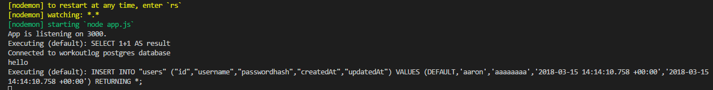
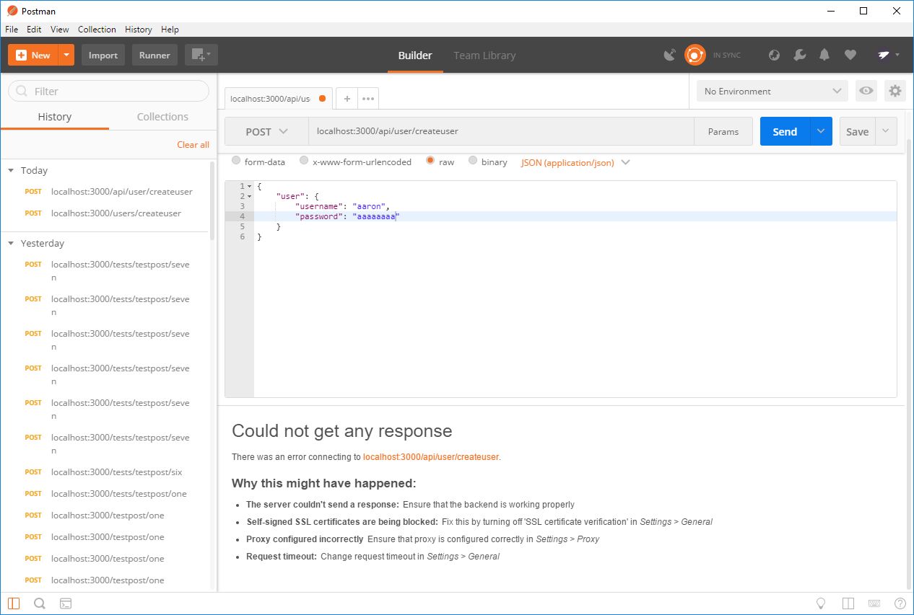
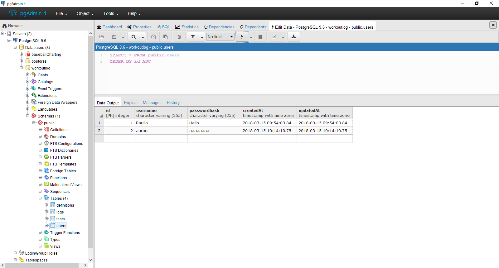
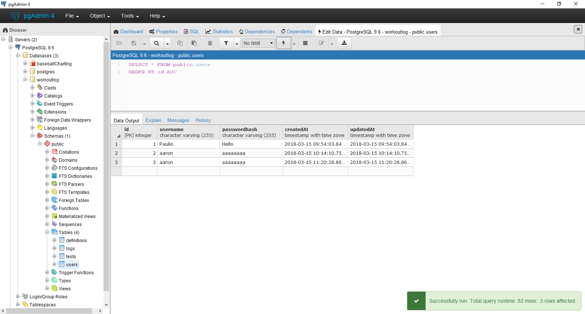

# USER CREATE
---
So far, we've just been putting data into a table in our database. However, if someone were to look at that data, there's no way to tell who actually put the data there. Additionally, there's no security protocols in place, so anyone can connect to the database and modify its contents in whatever way they choose. We can use JWT to fix both of these issues. We have a little bit of prep to do first, though: We'll use Sequelize and our User model to create a new user in the database. 

<hr />

### CreateUser Route
In order to create a user, we first have to set up a new route, which we'll call `createuser`. We'll create a simple sign up process, only requiring a username and a password. For testing purposes, we'll hard-code the values for each right now. Just like we imported the `test` model previously, we now import the `user` model. This forces any new user to conform to the model, as well as tell the database where to put the new data. Notice that we don't have any response to tell us if it worked right now.

```js
var express = require('express')
var router = express.Router()
var sequelize = require('../db');
var User = sequelize.import('../models/user');
var TestModel = sequelize.import('../models/test');

/***************
** HOME PAGE***
**************/
router.get('/', function (req, res) {
  res.send('This is a home page');
});

/*************************
** Create User STEP ONE***
**************************/
router.post('/createuser', function (req, res) {

  var username = "User Dude";
  var pass = "Hello";

  User.create({
    username: username,
    passwordhash: pass

  }).then(
    console.log("hello")
  );
})

module.exports = router;
```

### POSTMAN
Now that our route is set up, we can test it with Postman. First, though, open up your database in PG Admin and look at the data in the `users` table. It should be blank, like 
<br> <br>

Start your server then open Postman. Send a post request to the `createuser` route. Because we hard-coded the values for `username` and `password`, we don't actually have to include anything in the body section at the moment. You should see something like the following in Postman, PG Admin, and the console: <br>
<br>
<br>
<br>

Sometimes Postman will be stuck at "Waiting for response", because we aren't actually sending a response, and sometimes it might say that it couldn't connect to the database. We'll take care of that in a moment, but as long as you see the user in the table in PG Admin, you're fine.

### Creating a User
Now that we have a working route, let's add a user of our own. We remove the pre-set values of `username` and `password`, using the values that we'll supply instead. We'll keep the `console.log(hello)` for the moment as well. 
```js
router.post('/createuser', function (req, res) {

  var username = req.body.user.username;
  var pass = req.body.user.password;

  User.create({
    username: username,
    passwordhash: pass

  }).then(
    console.log("hello")
  );
})

module.exports = router;
```
Pull Postman back up. We'll post to the same route, but this time we'll supply a username and password. Notice that the server is expecting an object with the property `user`, which has its own properties `username` and `password`. After you `POST` the request, check PG Admin to see if your user was added to the table. Hopefully, you'll see results like this: <br>




### Creating a Response
Next on our list is to create a response for the server to send the client. Our token will be stored here once created to give to the client. For the moment, we'll leave the token stuff commented out. For now, just know that it's there and we'll talk about it in the next chapter. We also add a function to handle an error in creating the user. This could be any number of things: the database is offline, an invalid character in the username or password, no username or password provide, or something entirely different. We just want a single catch-all function to handle everything.

```js
//STEP 3
router.post('/createuser', function (req, res) {

  var username = req.body.user.username;
  var pass = req.body.user.password;

  User.create({
    username: username,
    passwordhash: pass

  }).then(
    //Sequelize is going to return the object it created from db.

    function createSuccess(user) {
      // var token = jwt.sign({id: user.id}, "i_am_secret", {expiresIn: 60*60*24});

      res.json({
        user: user,
        message: 'created'
        // sessionToken: token
      });
      console.log("**********USER:", user);
    },
    function createError(err) {
      res.send(500, err.message);
    }
  );
});

module.exports = router;
```
Hop back on Postman and send another `POST` request. You should receive a response back this time. The most important thing to notice here is that the response contains the plain-text password, meaning anyone that can intercept that response can steal the password. **NEVER SEND THE PLAIN-TEXT VERSION OF THE PASSWORD BACK!!!** It's a huge security risk, and can leave you vulnerable to just about anything. For our purposes right now, we don't care if someone gets the password, so it's not a problem right now. We will cover encryption in later chapters. <br>

Check your database to make sure that your new user went in. The console should print the `INSERT` SQL statement and the `user` object. You should see the following:




```js
//STEP 4
router.post('/createuser', function (req, res) {

  var username = req.body.user.username;
  var pass = req.body.user.password;

  User.create({
    username: username,
    passwordhash: pass

  }).then(
    //Sequelize is going to return the object it created from db.

    function createSuccess(user) {
      // var token = jwt.sign({id: user.id}, "i_am_secret", {expiresIn: 60*60*24});

      res.json({
        user: user,
        message: 'created'
        // sessionToken: token
      });
      console.log("**********USER:", user);
    },
    function createError(err) {
      res.send(500, err.message);
    }
  );
});

module.exports = router;
```
```js
//STEP 4
// router.post('/', function(req, res) {
// 		var username = req.body.user.username;
// 		var pass = req.body.user.password;
// 		//Need to create a user object and use sequelize to put that user into

// 		User.create({
// 			username: username,
// 			passwordhash: bcrypt.hashSync(pass, 10)
// 		}).then(
// 		//Sequelize is going to return the object it created from db.

// 			function createSuccess(user){
// 			    var token = jwt.sign({id: user.id}, "i_am_secret", {expiresIn: 60*60*24});

// 				res.json({
// 						user: user,
// 						message: 'created',
// 						sessionToken: token
// 				});
// 			},
// 			function createError(err){
// 				res.send(500, err.message);
// 			}
// 		);
// 	});

// module.exports = router;


// // var router = require('express').Router();
// var sequelize = require('../db.js');
// var User = sequelize.import('../models/user');
// var bcrypt = require('bcryptjs');
// var jwt = require('jsonwebtoken');

//Write the post method:
// router.post('/', function(req, res){
//     //1
//     var username = req.body.user.username;
//     var pass = req.body.user.password;
// })

//1 Explain how req.body is part of express.


// router.post('/', function(req, res) {
// 		var username = req.body.user.username;
// 		var pass = req.body.user.password;
// 		//Need to create a user object and use sequelize to put that user into

// 		User.create({
// 			username: username,
// 			passwordhash: bcrypt.hashSync(pass, 10)
// 		}).then(
// 		//Sequelize is going to return the object it created from db.

// 			function createSuccess(user){
// 			    var token = jwt.sign({id: user.id}, "i_am_secret", {expiresIn: 60*60*24});

// 				res.json({
// 						user: user,
// 						message: 'created',
// 						sessionToken: token
// 				});
// 			},
// 			function createError(err){
// 				res.send(500, err.message);
// 			}
// 		);
// 	});

// module.exports = router;
```