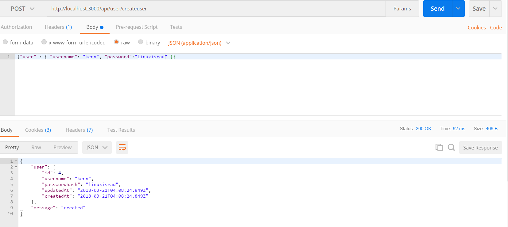

# USER CREATE ADDITIONS
---

In this module we'll refactor the user create controller method.

<hr />

### Refactor
Refactoring is just part of the game. We work in iterations. You write methods, you add to them, you take things away. In this chapter we don't have you rebuilding a POST controller method in seven steps like we did last time.  Let's do a quick refactor:

```js
router.post('/createuser', function (req, res) {

  var username = req.body.user.username;
  var pass = req.body.user.password;

  User.create({
    username: username,
    passwordhash: pass

  }).then(
    function createSuccess(user) {
      res.json({
        user: user,
        message: 'created' //1
      });
    },
    function createError(err) {
      res.send(500, err.message);
    }
  );
});

module.exports = router;
```
### Analysis

1. Along with the user object that gets returned as JSON, we can send a message in the response.

2. For the sake of time, we'll ask you to reread and review the flow of the above method. If you don't have an understanding, you'll want to review the information in the testcontroller in the `test/seven` method. One big difference here is that we have two properties instead of one.  

### Postman
Let's quickly test this iteration of the method with Postman.
1. Start your server then open Postman. 
2. Figure out the endpoint to send a post request to. 
3. Go to the body tab -> Choose Raw -> Change the dropdown to JSON.
4. Enter the request body. {"user" : { "username": "kenn", "password":"linuxsirad" }}
4. You should see the response string:


### Postgres
Check Postgres, too:


### Next
In the next module we'll add a token to the response. 