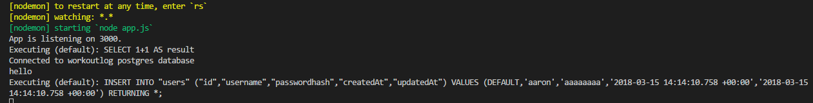
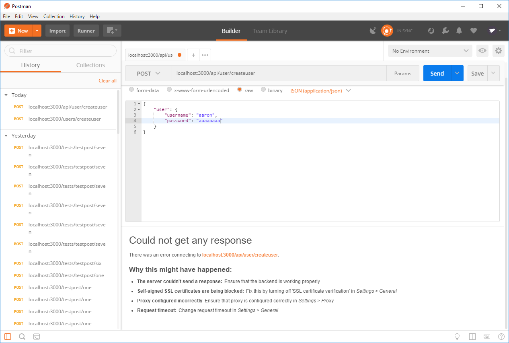
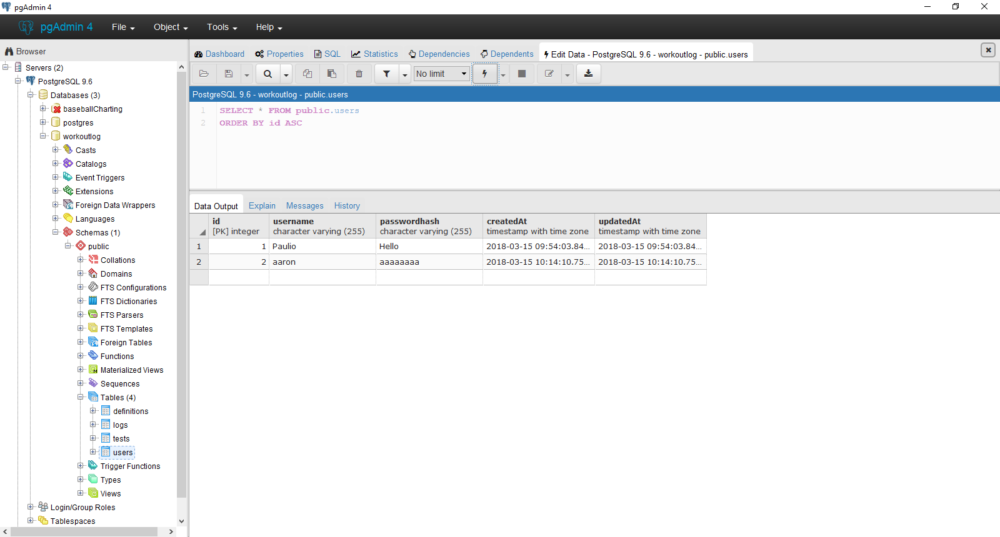

# CREATING A USER
---

Now that we have a working route, let's add a user of our own. We remove the pre-set values of `username` and `password`, using the values that we'll supply instead. We'll keep the `console.log(hello)` for the moment as well. 
```js
router.post('/createuser', function (req, res) {

  var username = req.body.user.username;
  var pass = req.body.user.password;

  User.create({
    username: username,
    passwordhash: pass

  }).then(
    console.log("hello")
  );
})

module.exports = router;
```
Pull Postman back up. We'll post to the same route, but this time we'll supply a username and password. Notice that the server is expecting an object with the property `user`, which has its own properties `username` and `password`. After you `POST` the request, check PG Admin to see if your user was added to the table. Hopefully, you'll see results like this: <br>



