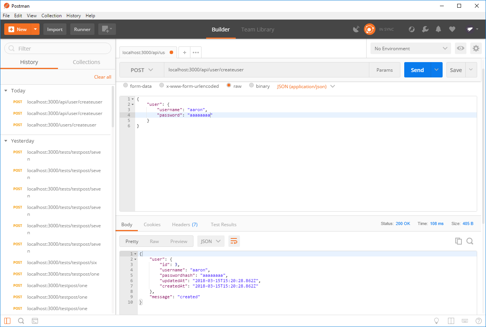
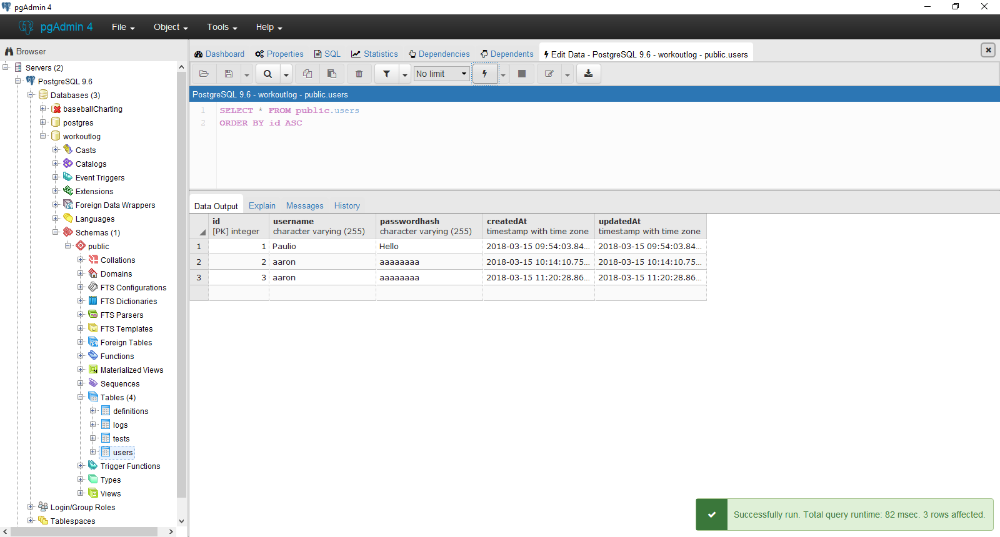

# CREATING A RESPONSE
---

Next on our list is to create a response for the server to send the client. Our token will be stored here once created to give to the client. For the moment, we'll leave the token stuff commented out. For now, just know that it's there and we'll talk about it in the next chapter. We also add a function to handle an error in creating the user. This could be any number of things: the database is offline, an invalid character in the username or password, no username or password provide, or something entirely different. We just want a single catch-all function to handle everything.

```js
//STEP 3
router.post('/createuser', function (req, res) {

  var username = req.body.user.username;
  var pass = req.body.user.password;

  User.create({
    username: username,
    passwordhash: pass

  }).then(
    //Sequelize is going to return the object it created from db.

    function createSuccess(user) {
      // var token = jwt.sign({id: user.id}, "i_am_secret", {expiresIn: 60*60*24});

      res.json({
        user: user,
        message: 'created'
        // sessionToken: token
      });
      console.log("**********USER:", user);
    },
    function createError(err) {
      res.send(500, err.message);
    }
  );
});

module.exports = router;
```
Hop back on Postman and send another `POST` request. You should receive a response back this time. The most important thing to notice here is that the response contains the plain-text password, meaning anyone that can intercept that response can steal the password. **NEVER SEND THE PLAIN-TEXT VERSION OF THE PASSWORD BACK!!!** It's a huge security risk, and can leave you vulnerable to just about anything. For our purposes right now, we don't care if someone gets the password, so it's not a problem right now. We will cover encryption in later chapters. <br>

Check your database to make sure that your new user went in. The console should print the `INSERT` SQL statement and the `user` object. You should see the following:


