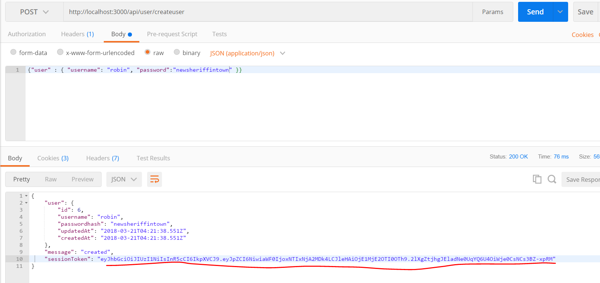
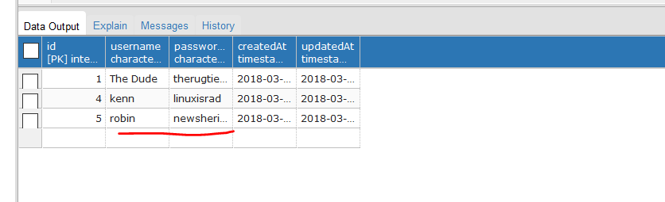

# TOKEN CREATION
---
In this module, we'll discuss tokens and start creating tokens in our app.

<hr />

### Token Parts
A token consists of three parts: 
1. The `header` (consists of the type of token and an algorithm to encode/decode).
2. The `payload` (the data being sent via the token; in our case, the username and password).
3. A `signature` (used by the algorithm to encode/decode the token. Without the signature, the token is useless). 

You don't have to dive deep now, maybe on your next iteration of learning, but you should at least go to the official [JWT](https://jwt.io/introduction/) website and look around. You can even create your own simulated token there to see how it works. The big takeaways are that there are heavy algorithms that make the token for you and that there are different parts of the token to learn about.<br>

### The Code
Let's go inside of the `usercontroller.js` file and into the `/createuser` POST method. Add the following code to the method:

```js
router.post('/createuser', function (req, res) {

  var username = req.body.user.username;
  var pass = req.body.user.password;

  User.create({
    username: username,
    passwordhash: pass

  }).then(

    function createSuccess(user) {
        //1           //2     //3           //4               //5
      var token = jwt.sign({id: user.id}, "i_am_secret", {expiresIn: 60*60*24});

      res.json({
        user: user,
        message: 'created',
        sessionToken: token //6
      });
    },
    function createError(err) {
      res.send(500, err.message);
    }
  );
});

module.exports = router;
```

### ANALYSIS
Let's walk through what we've added:
1. Create a variable to hold the token.
2. `.sign()` creates the token. It takes at least 2 parameters: the payload and the signature. You can also supply some specific options or a callback.
3. This is the payload, or data we're sending. `user.id` is the primary key of the user table and is the number assigned to the user when created in the database.
4. This is the signature, which is used to help encode and decode the token. You can make it anything you want, and we will make this private later.
5. We set an option to make the token expire. Here, we're taking (seconds * minutes * hours); in other words, 1 day.
6. We pass the value of the token back in our response. The server has now assigned a token to a specific user, and the client will have that token to work with (once we have a client).

### TESTING
1. Run in Postman:

 Notice that the token has come back as part of the response:

2. You should also check Postgres to be sure that the user has been added:



<hr />

### Review
1. When we create a user, the server will also create a token to send to the client. The server sends the token back to the client in the response. Most of the time, the client will store the token in `localStorage`, where it can be used in future requests. The token will be valid until it is removed or expired.

<hr />

# MAJOR SECURITY RISK
At the moment, our signature, `"i_am_secret"`, is available for everyone in the world to see via GitHub. This is extremely dangerous because there are robots and processes that scour public repositories looking for passwords and secret phrases. In our next module, we'll discuss a way to help keep sensitive information like this hidden.