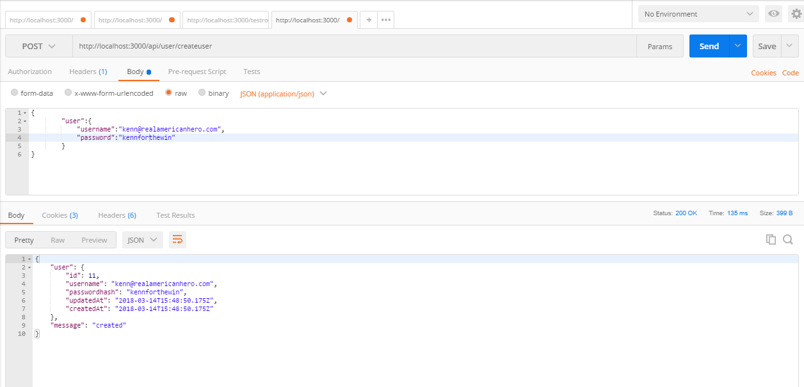
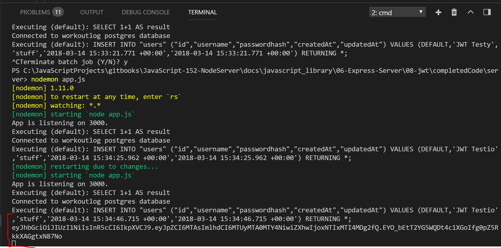

# TOKEN CREATION
---

A token consists of three parts: The `header` (consists of the type of token and an algorithm to encode/decode), the `payload` (the data being sent via the token; in our case, the username and password), and a `signature` (used by the algorithm to encode/decode the token. Without the signature, the toke is useless). Go to the official [jwt](https://jwt.io/) website and play around first. You can create your own simulated token there to see how it works. When messing around, don't change anything in the header section because could potentially break the token. The other two can be changed however you'd like, though, and notice how the token changes when you do. <br>

Now that you've seen how the token works, let's make one of our own.
<hr>

```js
router.post('/createuser', function (req, res) {

  var username = req.body.user.username;
  var pass = req.body.user.password;

  User.create({
    username: username,
    passwordhash: pass

  }).then(

    function createSuccess(user) {
        //1           //2     //3           //4               //5
      var token = jwt.sign({id: user.id}, "i_am_secret", {expiresIn: 60*60*24});
      console.log(token); 
      res.json({
        user: user,
        message: 'created' //6
      });
    },
    function createError(err) {
      res.send(500, err.message);
    }
  );
});

module.exports = router;
```

### ANALYSIS
[JWT Docs](https://github.com/auth0/node-jsonwebtoken). Take a look around here to see some of the functionality available. As for the above code:
1. Create a variable to hold the token.
2. `.sign()` creates the token. It takes at least 2 parameters: the payload and the signature. You can also supply some specific options or a callback.
3. This is the payload, or data we're sending. `user.id` is the primary key of the user table, and is number assigned to the user when created in the database.
4. This is the signature, used to help encode and decode the token. You can make it anything you want.
5. We set an option to make the token expire. Here, we're taking (seconds X minutes X hours); in other words, 1 day.
6. Though we've created the token, we haven't actually added it to the object yet.

### TESTING
Run in Postman. You will not see the token in Postman response yet:


You should see token in the console.
