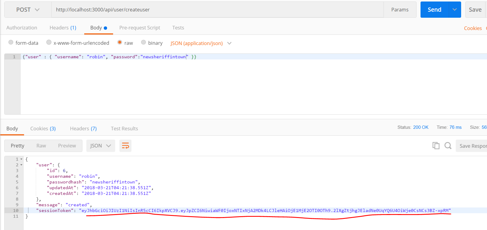

# DOTENV/.env
---
In this module, we'll work on making our signature private with the `.env` file. 

<hr/>

### Overview
As mentioned before, our signature is currently available to anyone who wants it on GitHub. We can use a package called `dotenv` to hold data that we want hidden, then we can have the program reach out to that file when the data is needed. We can then prevent this file from being uploaded to GitHub. `dotenv` provides a way to allow you to create secret keys that your application needs to function and keep them from going public.

<hr />

### File Set up
Let's start by adding a `.env` file to the root level:

```
javascript-library
    └── 5-Express Server
        └── Server
            └── controllers
            └── middleware
            └── models
            └── .env
            └── app.js
            └── db.js
```

### Import dotenv Package
We have already installed the `dotenv` package. In order to use it we need to go to `app.js` and require it at the top of the file:

```js
require('dotenv').config();//1 <--- ADD THIS LINE

var express = require('express');
var app = express();
var test= require('./controllers/testcontroller')
var user = require('./controllers/usercontroller')
var sequelize = require('./db');
var bodyParser = require('body-parser');

```

1. With this we can make items in an `.env` file available to our whole application.

### .env File
1. Add `*.env` to your `.gitignore` to prevent it from being published to GitHub.
2. In the `.env` file, add the secret. Put it in exactly like this:
```
JWT_SECRET="i_am_secret"
```

### Adding the Process Variable
Now, let's add the `process.env` variable to our method. See the comment below:

```js

router.post('/createuser', function(req, res) {
		var username = req.body.user.username;
		var pass = req.body.user.password;

		User.create({
			username: username,
			passwordhash: pass
		}).then(

			function createSuccess(user){					//1
			    var token = jwt.sign({id: user.id}, process.env.JWT_SECRET, {expiresIn: 60*60*24});
				res.json({
						user: user,
						message: 'created',
						sessionToken: token
				});
			},
			function createError(err){
				res.send(500, err.message);
			}
		);
	});

module.exports = router;

```

1. The system goes outside the current file to the `.env` file, where it looks for something called `JWT_SECRET`. The value of the secret is stored in that environment variable.

### Test 
We'll leave it up to you to test the app again with Postman and be sure that you get a token back. You should be getting the same result as you got in the last module:

