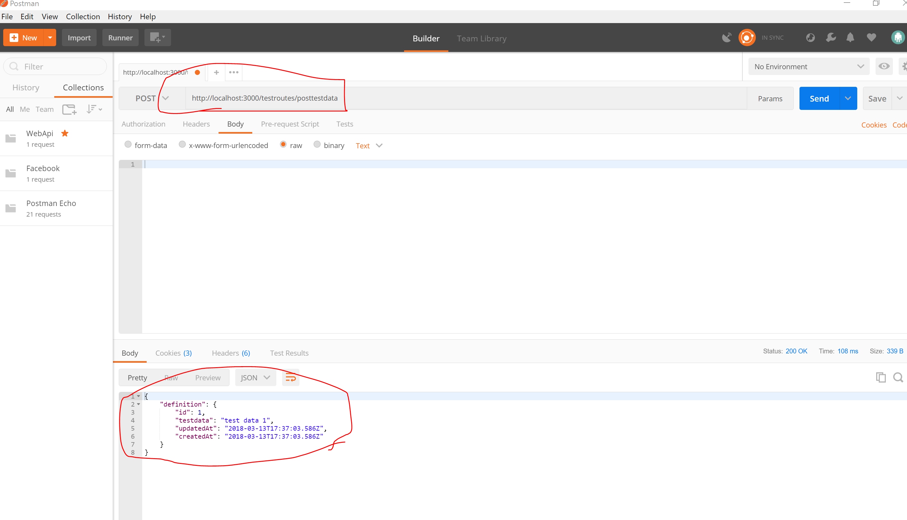

# TEST ROUTES
---

<hr>

TODO: Use these photos to explain stuff



```js
var express = require('express')
var router = express.Router()
var sequelize = require('../db');
var User = sequelize.import('../models/user');
var TestModel = sequelize.import('../models/test');

// middleware that is specific to this router
router.use(function timeLog (req, res, next) {
  console.log('Time: ', Date.now())
  next()
})
// define the home page route
router.get('/', function (req, res) {
  res.send('This is a big ole test route for routing')
})
// define the about route
router.get('/about', function (req, res) {
  res.send('This is an about route')
});

//Step 1 - Use with Postman
router.post('/testpost', function(req, res){
  res.send("Got a post request.")
})
```


TODO: Explain items in between these two....


```js
//Step 4 or 5
router.post('/posttestdata', function(req, res) {
  console.log("testing")
    var testData = req.body.testdata.item;
  
    // var testData = "test data 1";
  
    TestModel
    .create({ 
         testdata: testData
       })
  
      .then(
          function createSuccess(definition) {
          //send a response as json
             res.json({
               definition: definition
             });
           }, 
         function createError(err) {
             res.send(500, err.message);
         }
  
      );
  });
  
module.exports = router;

```

