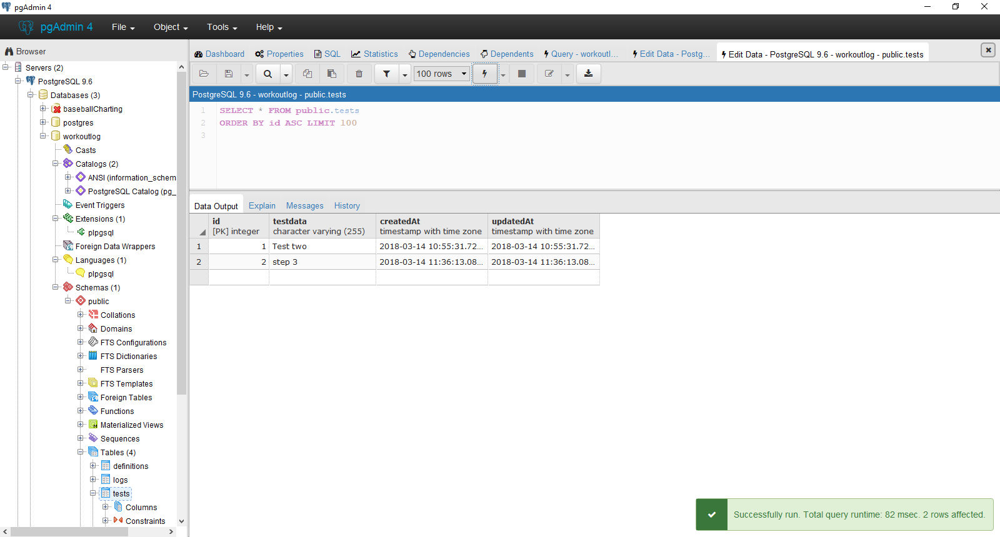

#TEST POST THREE
---

Our model works and we were able to put something in the database. NICE! Now let's change our request to accept data that we give it, then put that data into the database.
<hr>


```js

//STEP 3 - Use this with Postman
router.post('/testpost/three', function (req, res) {
  var testData = req.body.testdata.item; //1

  TestModel
    .create({//2
      testdata: testData
    })
  console.log("Test three went through.")
});


```


<hr >

### Analysis

1. This is what we're sending to the database. `req` is the actual request and `body` is where our data is being held. `testdata` is a property of `body`, while `item` is a property of `testdata`.
2. `create()` is a sequelize method. It makes a SQL statement to insert our data into the database. You'll learn more about SQL later.


### Challenge
Create a request and it to the above route. Your request must match the object syntax from above or Postman will not be able to read it. In PG Admin, click the button that looks like a lightning bolt to refresh the table. If successful, your database should look like  <br>
Also try sending data of a different type, like a number or `true`. What happens?