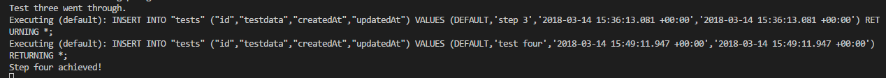

#TEST POST FOUR
---

It's great that our model and routes are working, but there was a slight hiccup with our last post: If you look at the console, you'll see that the success message actually printed BEFORE the data was inserted into the database. What if the insert had failed instead? We need to make sure that response to the user comes AFTER the insert statement.
<hr>


```js

//STEP 4 - Use this with Postman
router.post('/testpost/four', function (req, res) {
  var testData = req.body.testdata.item;
  TestModel
    .create({
      testdata: testData
    })
    .then( //1
      function message() { //2
        console.log("Step four achieved!");
      }
    );
});


```


<hr >

### Analysis

1. We use an asynchronous function to force the message to wait for the insert statement to finish.
2. The callback function will print the success message to the console.

### Challenge
Test the route above. Make sure that data is inserted before the success statement is printed. It should look like 
