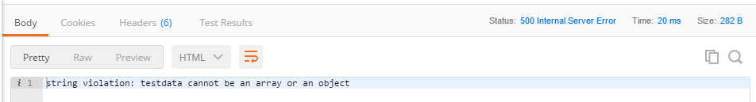

#TEST POST SEVEN
---

So far we've been assuming that our data is correctly entered into the database every time. Unfortunately, as well all know, things don't work that way, and inevitably something will go wrong. We need to create a fallback process to handle a failure.
<hr>


```js

router.post('/testpost/seven', function (req, res) {
  var testData = req.body.testdata.item;

  TestModel
    .create({
      testdata: testData
    })
    .then(
      function createSuccess(testdata) { //1
        //send a response as json
        res.json({
          testdata: testdata
        });
        console.log("step seven");

      },
      function createError(err) { //2  //3
        res.send(500, err.message); //4
      }
    );
});
```


<hr >

### Analysis
TODO: Explain this code:

1. Since we now have two functions returning a message, we change the name of the first to show that it fires upon success.
2. Our new function fires only if something goes wrong.
3. If we encounter a failure, the database will send back an error message. This is passed into our function as a parameter.
4. The response for our failure can be customized however we like. Generally, this response is a numerical code followed by the error message from the database.

### Challenge
When entering data into a database, the most common reason for failure is that the object trying to be added does not match the model. Change your data in Postman to an object. You should receive something like  <br>
Try to cause a failure in other ways. What do you see then? 