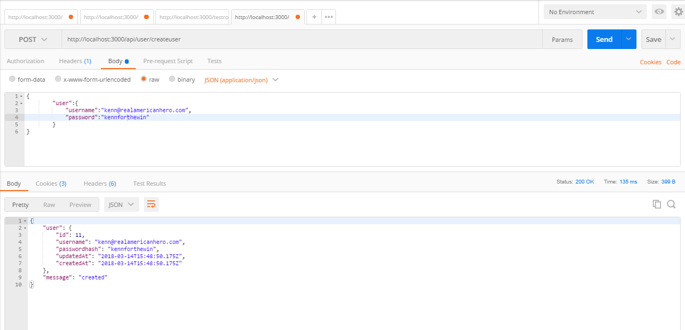
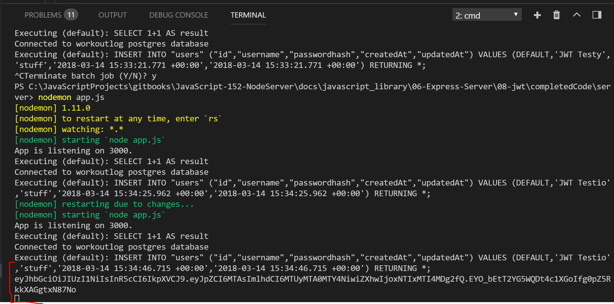

# TOKEN CREATION
---
In this module we'll create a token.

<hr>


```js
router.post('/createuser', function (req, res) {

  var username = req.body.user.username;
  var pass = req.body.user.password;

  User.create({
    username: username,
    passwordhash: pass

  }).then(

    function createSuccess(user) {
        //1           //2     //3           //4               //5
      var token = jwt.sign({id: user.id}, "i_am_secret", {expiresIn: 60*60*24});
      console.log(token);
      res.json({
        user: user,
        message: 'created'
      });
    },
    function createError(err) {
      res.send(500, err.message);
    }
  );
});

module.exports = router;
```

### TESTING
Run in Postman. You will not see the token in Postman response yet:


You should see token in the console.



### ANALYSIS
TODO: Link to the docs.
TODO: Go to the JWT docs and break the above stuff down.
1. 
2. 
3. 
4. 
5. 


