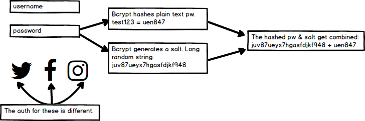
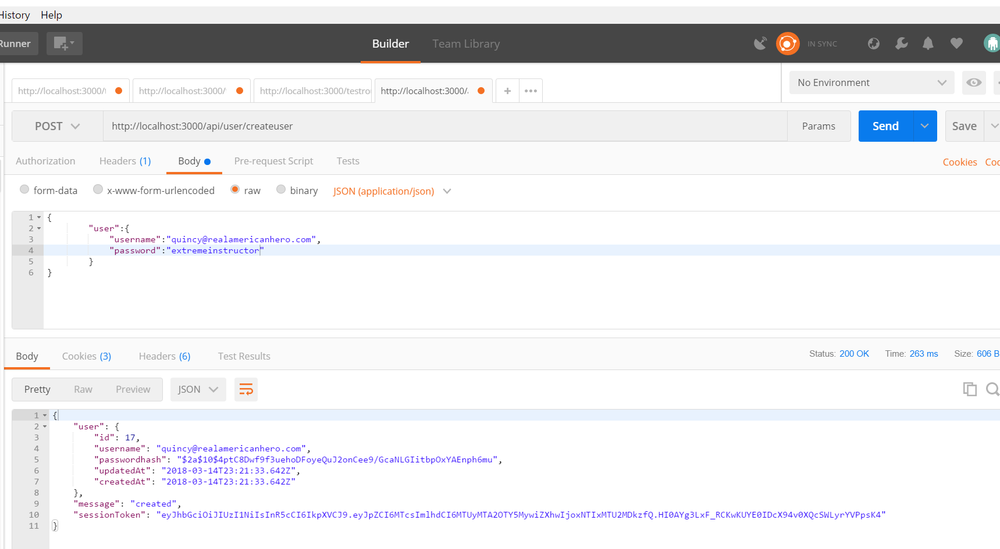

# BCRYPT SETUP
---

In this module we'll set up `bcrypt.js` in our application.

<hr/>

### Import
We already have the `bcryptjs` package in our `package.json` file. Once installed, we have to add it to the database. Just like with `jwt`, create a new variable. For its declaration, use the `require` statement for `bcryptjs`.

```js
var router = require('express').Router();
var sequelize = require('../db.js');
var User = sequelize.import('../models/user');
var bcrypt = require('bcryptjs'); //<---- ADD THIS
var jwt = require('jsonwebtoken');

```

### Adding bcrypt
Let's add bcrypt into the create method with the `pass` value for the `passwordhash` property:
```js
router.post('/', function(req, res) {
		var username = req.body.user.username;
		var pass = req.body.user.password;

		User.create({
            username: username,
			passwordhash: bcrypt.hashSync(pass, 10)  //1 ADD THIS TO THE PROPERTY VALUE
		}).then(
			function createSuccess(user){
				var token = jwt.sign({id: user.id}, process.env.JWT_SECRET, {expiresIn: 60*60*24});

				res.json({
						user: user,
						message: 'created',
						sessionToken: token
				});
			},
			function createError(err){
				res.send(500, err.message);
			}
		);
	});

module.exports = router;
```

### Examining bcrypt.hashSync()
Here's a short diagram to give you an overview:


We're adding the `hashSync()` function to our new User object so that we don't store the password in a format that is easy to read. We supply the original password and tell bcrypt to use the salt 10 times.

Like JWT, there is a lot more to know and do with bcrypt. We are giving you enough to get started, but it would be wise to take a look through the [bcryptjs Docs](https://github.com/dcodeIO/bcrypt.js).

### POSTMAN
Test in Postman. 


Test in Postgres:


### Conclusion
At the moment, we have the ability to add new users to our database. Unfortunately, those users currently do not have a way back in after the initial signup, which defeats the purpose of having an account. In the next chapter, we'll setup a login route for existing users to access the database with their credentials.
