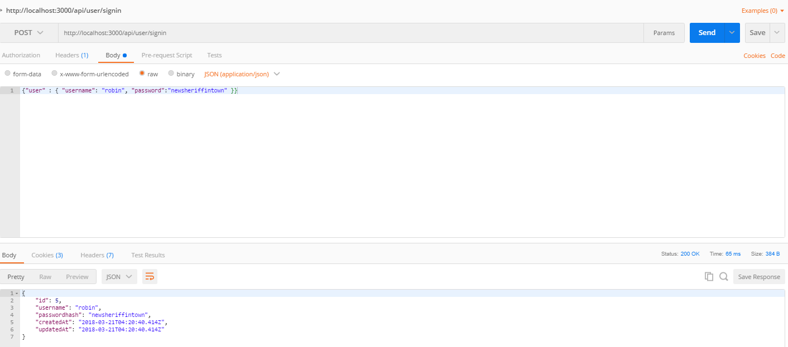
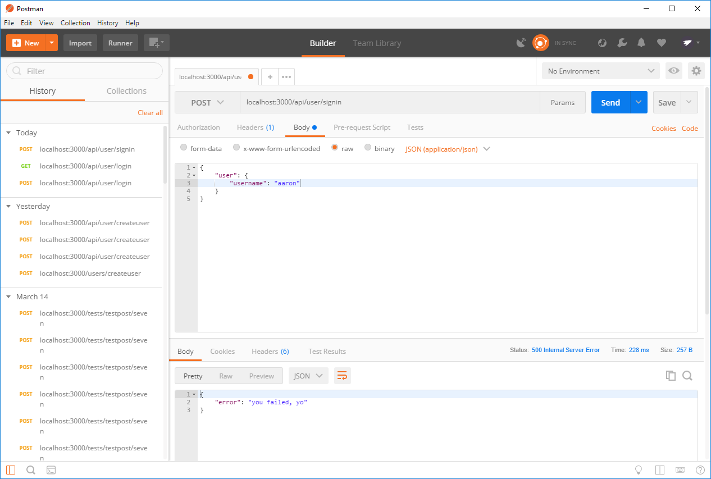

# SIGN IN
---
In this module we'll start making the sign in method to create a new session.

<hr>

### The code
Let's create our signin route. Add the following to the bottom of `usercontroller.js` file in `controllers`. Like the signup route, each step will keep building on top of the previous, until we have the finished product at the end:

```js
		//7
router.post('/signin', function(req, res) {
            //1     //2       //3                                   //4
	User.findOne( { where: { username: req.body.user.username } } ).then(
    
        //5
        function(user) {
			if (user !== null) {
				res.json(user);
			} else {
				res.status(500).send({ error: "you failed, yo" }); //6
			}
		}
	);
});

```
### Analysis
Try reading the code above to see if you can get an intuitive sense of what is happening. Then, take a look at the following points for guidance or clarification:

1. The `findOne()` method is a sequelize method that does exactly what it says: it tries to find something within the database that we tell it to look for. This is called Data retrieval. Check out the Sequelize docs [here](http://docs.sequelizejs.com/manual/tutorial/models-usage.html).
2. `where` is an object within sequelize that tells the database to look for something matching its properties.
3. We're looking in the `username` column in the `user` table for one thing that matches the value passed from the client.
4. The promise is handled within the `.then()` function.
5. Here we have a function that is called when the promise is resolved, and if successful sends the `user` object back in the response.
6. Function called if the promise is rejected. We print the error to the console. 
7. We're sending data this time, so we use `router.post` instead of `router.get`.

### Test
Start your server and open Postman. Send a request to the `signin` route with the username of one of the users in your database. NOTE: THIS USER SHOULD EXIST IN YOUR DB.  You should see the user object print to the console:


 <br>
Send another request, this time with a user not in the database. You should be hitting the error function and seeing something like this:
. <br>
