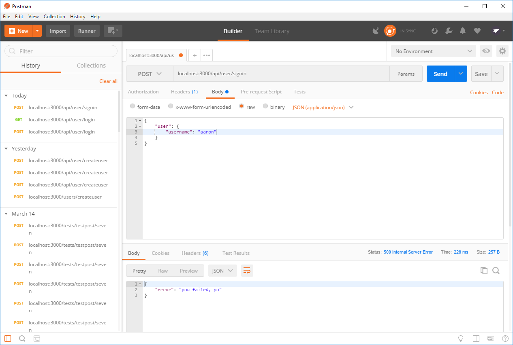
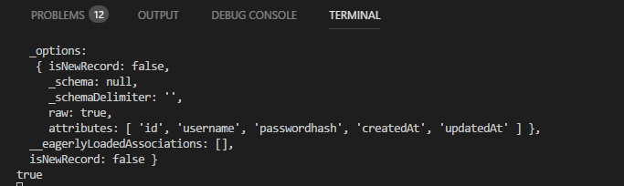
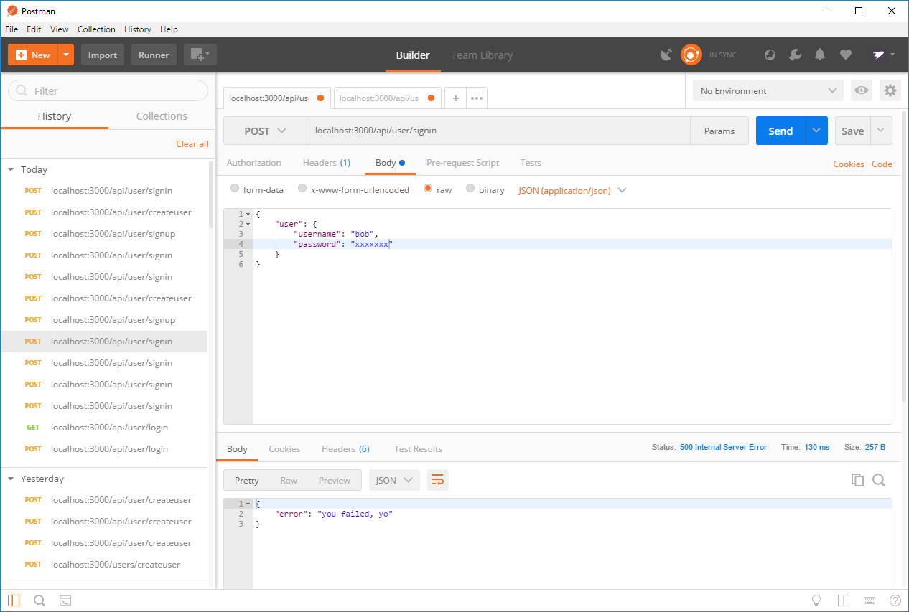

### SIGN IN
---

Let's create our signin route. Add the following to your bottom of `user.js` file in `routes`. Like the signup route, each step will keep building on top of the previous, until we have the finished product at the end.
```js
router.post('/signin', function(req, res) {

});

```

### `findOne()`
The following code goes inside the empty `signin` route. Add it and we'll talk about what it's doing in a moment.
```js
router.post('/', function(req, res) {
            //1     //2       //3                                   //4
	User.findOne( { where: { username: req.body.user.username } } ).then(
    
        //5
        function(user) {
            console.log(user);
		},
		//6
		function(err) {
			res.json(err);
		}
	);
});

```
### Analysis
1. `findOne` is sequelize method that does exactly what it says: it tries to find something within the database that we tell it to look for. It returns a promise.
2. `Where` is a object within sequelize that tells the database to look for something matching its properties.
3. We're looking in the `username` column in the `user` table for something that matches the value passed from the client.
4. The promise is handled within `.then()`.
5. Function called when the promise is resolved. We print the user to the console.
6. Function called when the promise is rejected. We print the error to the console. 

### Postman
Start your server and open Postman. Send a request to the `login` route with the username of of one of the users in your database. You should see the user object print to the console. <br>
Send another request, this time with a user not in the database. You should see something like this:
 <br>

### STEP THREE
At the moment, we're only checking that the username matches something in the database. This would be a giant security issue, as the password provided isn't even needed! The following code goes in the function to resolve the promise. Enter it in and we'll talk after.

```js
router.post('/signin', function (req, res) {
	User.findOne({ where: { username: req.body.user.username } }).then(
		function (user) {
			console.log("User:", user);
			//1
			if (user) {
				//2				//3						//4					//5
				bcrypt.compare(req.body.user.password, user.passwordhash, function (err, matches) {
					console.log(matches); //6
				});
			} else { //7
				res.status(500).send({ error: "failed to authenticate" });
			}
		},
		function (err) {
			res.json(err);
		}
	);
});
```

### What Did We Just Do?
1. Checks again to make sure that a match for the username was found.
2. Before we used `bcrypt` to encrypt the password. Now we use it to decrypt the hash value and compare it to the supplied password.
3. Pulls the password value from the request.
4. Pulls the hashed password value from the database.
5. Callback function that will run on either success or failure of `compare`.
6. Print to the console if the password values match.
7. Handle situations where matching isn't possible or user not found.

Send another request to the `signin` route, but remember to include the password this time. We're not sending a response back yet when successful, so you'll know if worked if you see this in the console:



### Step Four
So both the username and password values match what's in the database. Next up is giving the user a token for access to the database.This code will replace the `console.log()` inside of the `compare` method.
```js
router.post('/signin', function (req, res) {
	User.findOne({ where: { username: req.body.user.username } }).then(
		function (user) {
			console.log("User:", user);
			if (user) {
				bcrypt.compare(req.body.user.password, user.passwordhash, function (err, matches) {
						//1
					if (matches) {
						//2				
						var token = jwt.sign({ id: user.id }, process.env.JWT_SECRET, { expiresIn: 60 * 60 * 24 });
						console.log(token);
					} else {
						//3
						res.status(500).send({ error: "you failed, yo" });
					}
				});
			} else {
				res.status(500).send({ error: "failed to authenticate" });
			}
		},
		function (err) {
			res.json(err);
		}
	);
});
```
1. The callback function from before will return either `err` or `match`, depending on the result. We evaluate that return here.
2. Add a token to the user on success. This is the same code we run in `signup`. For the moment, we print the token to the console.
3. If the passwords don't match, we send a response telling the client that the passwords don't match.

Run two requests in Postman, one successful and one unsuccessful. You should see the following: <br>
Success <br>



### STEP FIVE
The last thing we need to do is send the token back to the client when successful. We add the response, fill it with information, and send it on its way. Our response will look the same as it did on the `signin` route.

```js
router.post('/signin', function (req, res) {
	User.findOne({ where: { username: req.body.user.username } }).then(
		function (user) {
			if (user) {
				bcrypt.compare(req.body.user.password, user.passwordhash, function (err, matches) {
					if (matches) {
						var token = jwt.sign({ id: user.id }, process.env.JWT_SECRET, { expiresIn: 60 * 60 * 24 });
							//1
						res.json({
							user: user, //2
							message: "successfully authenticated", //3
							sessionToken: token //4
						});
					} else {
						res.status(500).send({ error: "you failed, yo" });
					}
				});
			} else {
				res.status(500).send({ error: "failed to authenticate" });
			}
		},
		function (err) {
			res.json(err);
		}
	);
});
```

1. Create the response to be sent back.
2. Add the user object to the response as a property.
3. Add a message to tell the user that things were successful.
4. Add the token to the response to be sent back to the user.

Send one more request to Postman. Here should be your final result:
