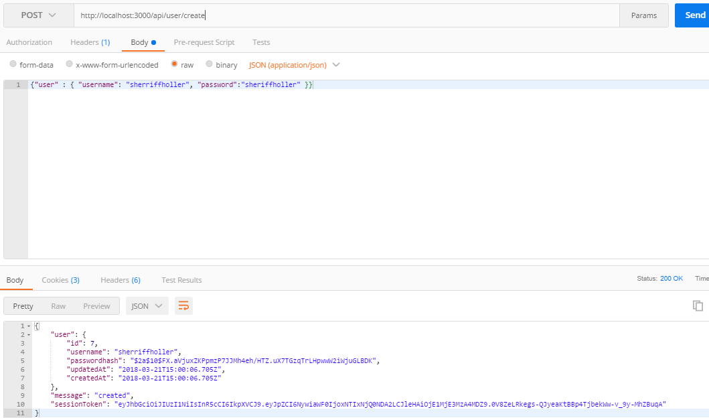
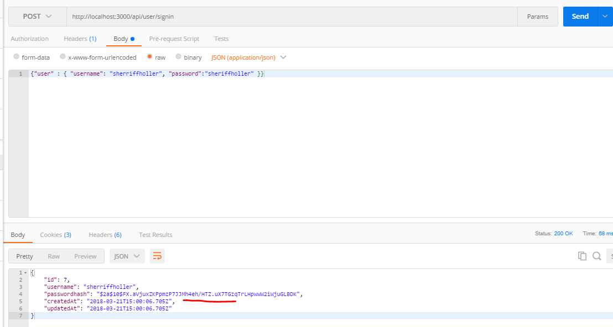

### ADDING BCRYPT TO SIGNIN
---
In this module we'll add bcrypt to our sign in request. 

<hr />

### bcrypt.compare()
At the moment, we're only checking that the username matches something in the database. This would be a giant security issue, as the password provided isn't even needed! The following code goes into the function to and uses the `compare()` method, provided by bcrypt: 

```js
router.post('/signin', function (req, res) {
	User.findOne({ where: { username: req.body.user.username } }).then(
		function (user) {
			//1
			if (user) {
				      //2				//3						//4			//5
				bcrypt.compare(req.body.user.password, user.passwordhash, function (err, matches) {
					console.log("The value matches:", matches); //6
				});
			} else { //7
				res.status(500).send({ error: "failed to authenticate" });
			}
		},
		function (err) {
			res.json(err);
		}
	);
});
```

### What Did We Just Do?
1. First we check to make sure that a match for the username was found.
2. Before we used `bcrypt` to encrypt the password. Now we use it to decrypt the hash value and compare it to the supplied password. You can read more about it at the [npm registry](https://www.npmjs.com/package/bcryptjs).
3. Pulls the password value from the current request when the user is signing up.
4. Pulls the hashed password value from the database. 
5. Callback function that will run on either success or failure of `compare`.
6. Print to the console if the password values match.
7. Handle situations where matching isn't possible or user not found.

### Test
1. Fire up Postman.
2. For the sake of clarity, let's be sure we can still create a new user:

3. Change the request endpoint to /signin instead of create and press send:

4. It's important to note that the request body has stayed the same. Same user and same password as before. 