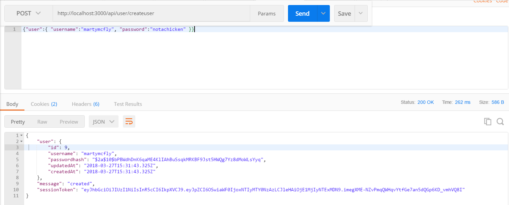
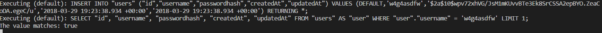

### ADDING BCRYPT TO SIGNIN
---
In this module, we'll add bcrypt to our sign in request for security when creating a new session. 

<hr />

### bcrypt.compare()
At the moment, we're only checking that the username matches something in the database. This would be a giant security issue, since the password doesn't even get checked! We are going to expand our `/signin` method here, so be aware that we are adding to the previous method where you see comments: 

```js
router.post('/signin', function (req, res) {
	User.findOne({ where: { username: req.body.user.username } }).then(
		function (user) {
			//1
			if (user) {
				      //2				//3						//4			//5
				bcrypt.compare(req.body.user.password, user.passwordhash, function (err, matches) {
					console.log("The value matches:", matches); //6
				});
			} else { //7
				res.status(500).send({ error: "failed to authenticate" });
			}
		},
		function (err) {
			res.status(501).send({ error: "you failed, yo" });
		}
	);
});
```

### What Did We Just Do?
1. First we check to make sure that a match for the username was found.
2. Before, we used `bcrypt` to encrypt the password. Now, we use it to decrypt the hash value and compare it to the supplied password. This is a complex task, and we let the highly reputable and revered bcrypt package handle the algorithm for doing that. As a best practice, you shouldn't try to write this or use something that you have written. First of all, it will take months of your life to rebuild something that is already working. You can read more about `bcrypt.compare()` at the [npm registry](https://www.npmjs.com/package/bcryptjs).
3. Here we pull in the password value from the current request when the user is signing up.
4. This pulls the hashed password value from the database. 
5. Run a callback function that will run on either success or failure of `compare`.
6. If the hashed password in the database matches the one that has been entered, print to the console that the password values match. Note that the `matches` variable is a boolean.
7. Handle situations where the match fails.

<hr />

### Test
1. Fire up Postman.
2. For the sake of clarity, let's be sure we can still create a new user:

3. Change the request endpoint to `/signin` instead of `/createuser` and press send:

4. It's important to note that the request body has stayed the same (same user and same password as before). It's also important to note that something is missing from the response. What would that be? See the next section for the answer.