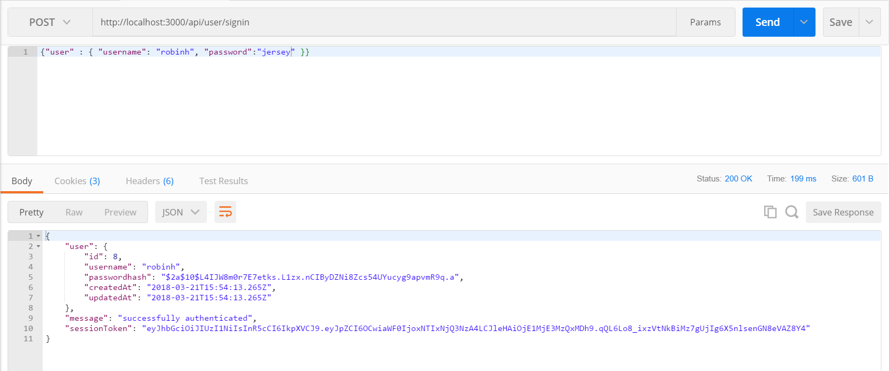

# JWT
---
In this module we will add our token in with our sign in request.

<hr />


### The Code
So both the username and password values match what's in the database. Next up is giving the user a token for access to the database.This code will replace the `console.log()` inside of the `compare` method.
```js


router.post('/signin', function(req, res) {
	User.findOne( { where: { username: req.body.user.username } } ).then(
		function(user) {
			if (user) {
				bcrypt.compare(req.body.user.password, user.passwordhash, function(err, matches){
					if (matches) {
						var token = jwt.sign({id: user.id}, process.env.JWT_SECRET, {expiresIn: 60*60*24 });
						res.json({
							user: user,
							message: "successfully authenticated",
							sessionToken: token
						});
					}else {
						res.status(500).send({ error: "you failed, yo" });
					}
				});
			} else {
				res.status(500).send({ error: "failed to authenticate" });
			}
		},
		function(err) {
			res.json(err);
		}
	);
});


```

### Analysis
1. Here we use the callback function from the `compare()` method. If the username and password are a match, this will be set to true, and the expression in the conditional will execute.
2. Upon success, we will create a new token for the session. This uses the same method that we used upon sign up. We will let you review that code if you need clarification.
3. We return the user object with a success message and sessionToken.
4. If the passwords don't match or the username is not correct, we send a response telling the client that authentication did not occur.

<hr />

### Test
1. Run two requests in Postman. 
2. Log in with a username and password that you know exist:

3. Try logging in with a user that doesn't exist or with a user exists with the wrong password:


<hr />

### Quick Summary
1. Here we've added bcrypt to compare passwords entered by the client with the password in the database. 
2. If the sign in is successful, we send a token back to the user.
3. If the sign in is not successful, we send an authentication error.

