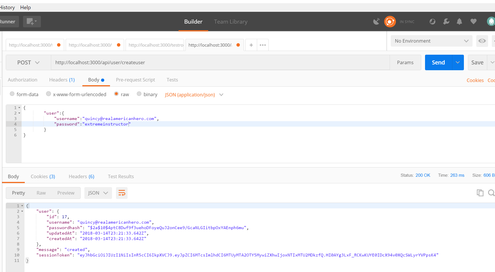

# BCRYPT SETUP
---

In this module we'll set up `bcrypt.js` in our application.

<hr/>

### Import
First, install the bcrypt package. Let's go ahead and add it to our `package.json` file and run `npm update`:

```js
"dependencies": {
    "bcryptjs": "^2.4.0",
    "body-parser": "^1.15.1",
    "dotenv": "^4.0.0",
    "express": "^4.13.4",
    "jsonwebtoken": "^7.2.1",
    "pg": "^4.5.6",
    "pg-hstore": "^2.3.2",
    "sequelize": "^3.23.3"
  }

```


```js
var router = require('express').Router();
var sequelize = require('../db.js');
var User = sequelize.import('../models/user');
var bcrypt = require('bcryptjs');
var jwt = require('jsonwebtoken');

```


### Examining bcrypt.hashSync()
TODO: Point to the bcrypt docs and show `hashSync`
TODO: Discuss hashing. There are screenshots in the original docs. 

### Adding bcrypt
Implement bcrypt into the create:
```js
router.post('/', function(req, res) {
		var username = req.body.user.username;
		var pass = req.body.user.password;

		User.create({
            username: username,
			passwordhash: bcrypt.hashSync(pass, 10)  //1 ADD THIS TO THE PROPERTY VALUE
		}).then(
			function createSuccess(user){
				var token = jwt.sign({id: user.id}, process.env.JWT_SECRET, {expiresIn: 60*60*24});

				res.json({
						user: user,
						message: 'created',
						sessionToken: token
				});
			},
			function createError(err){
				res.send(500, err.message);
			}
		);
	});

module.exports = router;
```

### POSTMAN
Test in Postman. 


Test in 


### Analysis
TODO: Here Bcrypt is used to.........


