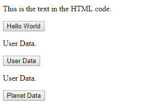

# TEST CLIENT
---
In this module we're going to set up a Test Client for testing our requests. 

<hr />

### File Structure
```
    └── 7-Express Server
            └── server
            └── client
                └── index.html
                └── scripts.js
```
<hr>

### index.html
Copy the following code into the `index.html` file. Before we talk more about it, use what you learned previously about client-side programming and see if you can guess what this code is doing:

```html
<!DOCTYPE html>
<html>
<head>
    <title>Basic Client</title>
</head>
<body>

    <p id="para">This is the text in the HTML code.</p>
    <button onclick="fetchHelloDataFromAPI();">Hello World</button>
    
    <p id="paraTwo">User Data.</p>
    <button onclick="getUserDataFromAPI();">User Data</button>

    <p id="paraThree">User Data.</p>
    <button onclick="getPlanetDataFromAPI();">Planet Data</button>

    <script src="scripts.js"></script>
</body>
</html>
```

<br>
You can see that we aren't doing too much here. We have 3 `<p>` elements, each with a `<button>` that calls a different function when clicked. Each of the `<p>` elements have an id attribute so that we can access them later. Our js file is linked at the bottom, but since we don't really care what this looks like, we don't have any css file linked. You should see this when you open the page in your browser: <br>  <hr>

### scripts.js
Enter the following code into the `scripts.js` file. We'll talk about it in a minute.

```js
function fetchHelloDataFromAPI() {
	var helloWorld = document.getElementById('para');
	
	fetch('http://localhost:3000/api/testing')
		.then(function (response) {
			console.log("Fetch response:", response)
			return response.text() 
		})
		.then(function (text) {
			console.log("Put this in the html");
			console.log(text);
			helloWorld.innerHTML = text;
		});
  }


  function getUserDataFromAPI() {
	var userData = document.getElementById('paraTwo');
	
	fetch('http://localhost:3000/api/userdata')
		.then(function (response) {
			console.log("Fetch response:", response)
			return response.json() 
		})
		.then(function (json) {
			console.log("Put this in the html");
			console.log(json);
			userData.innerHTML = json.user;
		});
  }

  function getPlanetDataFromAPI() {
	var userData = document.getElementById('paraThree');
	
	fetch('http://localhost:3000/moredata.json')
		.then(function (response) {
			console.log("Fetch response:", response)
			return response.json() 
		})
		.then(function (json) {
			var residents = json.residents;
			console.log("Put this in the html");
			console.log(json);
			for(r of residents){
				console.log(r);
				userData.innerHTML = r;
			}
		});
  }
```

Each of these functions is called by one of the three buttons, and each runs a fetch to a different endpoint. After the fetch, each prints a line of text the console to test that it worked and then prints the response. After this, each function uses the `innerHTML` method to put the response data into one of the `<p>` elements. <br>

Notice that the third function is structured a little differently from the first two. Instead of making an API call, it's pulling from a pre-existing file. When you `fetch` data from an API, it's returned as a JSON file and is processed from that point; in this case, we already have the file, so we skip the API call and move straight to processing the data. In addition, our JSON file contains a property called residents, which we iterate over and print its contents.
<hr>

### moredata.json
Finally, since we're fetching data from a file, we have to create that file first. Inside of your server folder, create a new folder called `data`. Inside of this folder, create a new file called `moredata.json` and add the following data to it:

```json
{
    "climate": "Mild",
    "diameter": "1046",
    "gravity": "2 standard",
    "name": "Tatooine",
    "orbital_period": "304",
    "population": "20000",
    "residents": [
        "https://swapi.co/api/people/1/",
        "https://swapi.co/api/people/2/"
    ],
    "rotation_period": "23",
    "surface_water": "1",
    "terrain": "Dessert",
    "url": "https://swapi.co/api/planets/1/"
}
```

You can see the residents property we mentioned before, as well as a lot of other data that could potentially be called. Now that our setup is out of the way, we can dive into the concept of middleware and see how it interacts with both the client and the server.